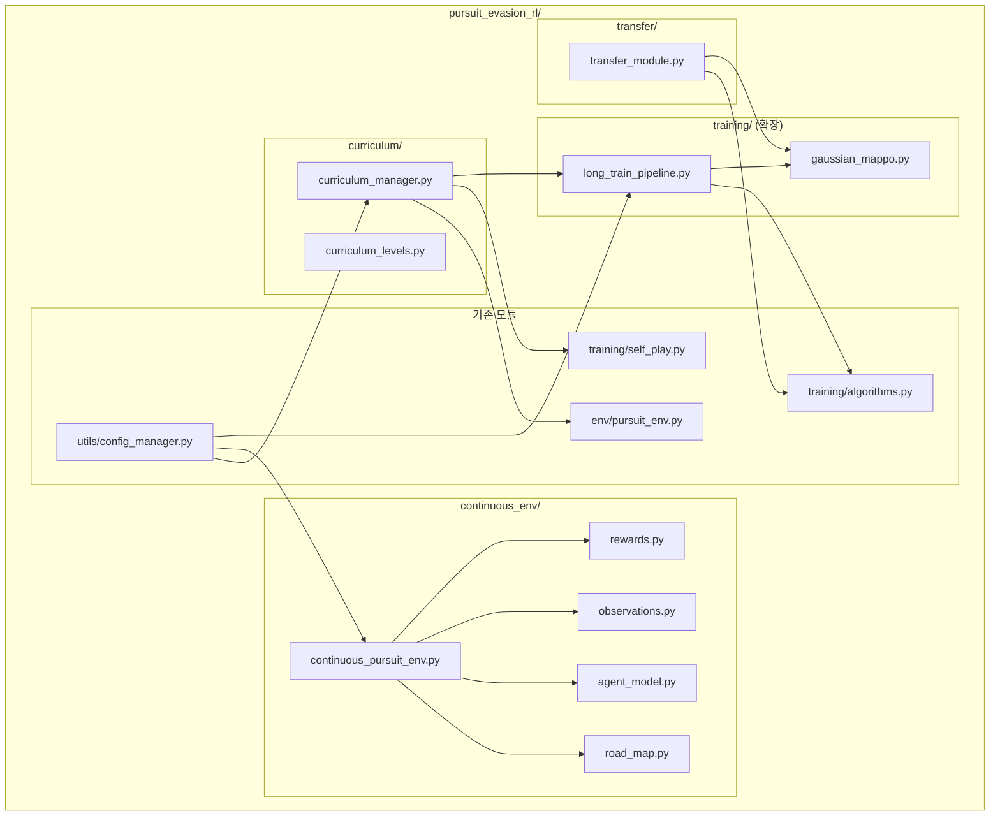
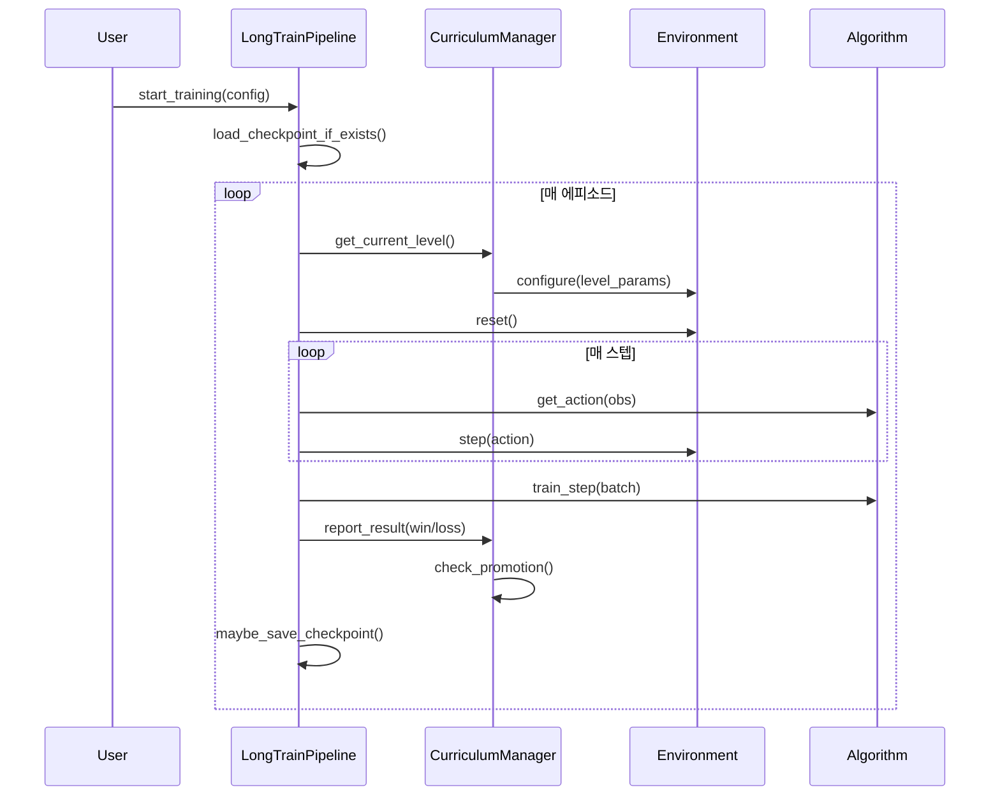

# Design Document: Continuous Pursuit Environment

## Overview

본 설계 문서는 기존 이산 그래프 기반 추격-도주 RL 시뮬레이션을 확장하여 다음 기능을 구현하기 위한 기술 설계를 정의한다:

1. **커리큘럼 학습 매니저** — 이산 환경에서 점진적 난이도 조절을 통한 경찰 정책 강화
2. **장기 학습 파이프라인** — 10,000+ 에피소드의 안정적 학습 실행 및 체크포인트 기반 재개
3. **연속 2D 도로 환경** — Road Segment 기반 연속 좌표 공간에서의 추격-도주 시뮬레이션
4. **Gaussian MAPPO** — 연속 행동 공간을 위한 정책 그래디언트 알고리즘
5. **전이 학습 모듈** — 이산 환경 학습 결과를 연속 환경 초기값으로 활용

기존 `pursuit_evasion_rl/` 패키지 구조를 확장하여 `curriculum/`, `continuous_env/`, `transfer/` 서브패키지를 추가한다.

## Architecture

### 전체 시스템 아키텍처



### 학습 파이프라인 흐름



## Components and Interfaces

### 1. CurriculumManager (`pursuit_evasion_rl/curriculum/curriculum_manager.py`)

```python
@dataclass
class CurriculumLevel:
    """커리큘럼 난이도 단계 정의."""
    level_id: int
    name: str
    num_nodes: int          # 그래프 노드 수
    density: float          # 연결 밀도
    boundary_ratio: float   # 경계 노드 비율
    num_police: int         # 경찰 수

class CurriculumManager:
    """커리큘럼 학습 난이도 전환 관리자."""
    
    def __init__(self, levels: list[CurriculumLevel], config: dict) -> None:
        """
        Args:
            levels: 난이도 단계 리스트 (최소 3개)
            config: 설정. 키:
                - win_rate_threshold: 승률 임계값 (기본 0.9)
                - promotion_window: 평가 에피소드 수 (기본 500)
        """
    
    def get_current_level(self) -> CurriculumLevel: ...
    def report_episode_result(self, is_police_win: bool) -> None: ...
    def should_promote(self) -> bool: ...
    def promote(self) -> bool: ...
    def is_completed(self) -> bool: ...
    def get_stats(self) -> dict: ...
    def save_state(self, path: str) -> None: ...
    def load_state(self, path: str) -> None: ...
```

### 2. LongTrainPipeline (`pursuit_evasion_rl/training/long_train_pipeline.py`)

```python
class LongTrainPipeline:
    """장기 학습 실행 및 체크포인트 관리 파이프라인."""
    
    def __init__(self, config: dict) -> None:
        """
        Args:
            config: 학습 설정. 키:
                - max_episodes: 최대 에피소드 수
                - checkpoint_interval: 체크포인트 저장 간격
                - log_interval: 로깅 간격
                - checkpoint_dir: 체크포인트 저장 디렉토리
        """
    
    def train(self) -> None: ...
    def resume(self, checkpoint_path: str) -> None: ...
    def save_checkpoint(self, episode: int) -> None: ...
    def load_checkpoint(self, path: str) -> dict: ...
    def _run_episode(self) -> dict: ...
    def _log_stats(self, episode: int) -> None: ...
```

### 3. RoadMap (`pursuit_evasion_rl/continuous_env/road_map.py`)

```python
@dataclass
class RoadSegment:
    """도로 구간 정의."""
    segment_id: int
    start_point: tuple[float, float]   # (x, y)
    end_point: tuple[float, float]     # (x, y)
    control_points: list[tuple[float, float]] | None  # 베지어 제어점 (최대 2개)
    width: float
    speed_limit: float

@dataclass 
class Intersection:
    """교차점 정의."""
    position: tuple[float, float]      # (x, y)
    connected_segments: list[int]      # 연결된 segment_id 목록

class RoadMap:
    """연속 2D 도로 네트워크 관리."""
    
    def __init__(self, config: dict) -> None: ...
    
    def load_from_file(self, path: str) -> None: ...
    def generate_grid(self, rows: int, cols: int, spacing: float) -> None: ...
    def generate_radial(self, rings: int, spokes: int) -> None: ...
    def generate_random(self, num_segments: int, seed: int | None = None) -> None: ...
    
    def get_segments(self) -> list[RoadSegment]: ...
    def get_intersections(self) -> list[Intersection]: ...
    def get_boundary_exits(self) -> list[tuple[float, float]]: ...
    def is_on_road(self, position: tuple[float, float], tolerance: float) -> bool: ...
    def nearest_point_on_road(self, position: tuple[float, float]) -> tuple[float, float]: ...
    def get_segment_at(self, position: tuple[float, float]) -> RoadSegment | None: ...
    def validate_connectivity(self) -> list[int]: ...  # 비연결 세그먼트 ID 반환
```

### 4. ContinuousPursuitEnv (`pursuit_evasion_rl/continuous_env/continuous_pursuit_env.py`)

```python
class ContinuousPursuitEnv(gymnasium.Env):
    """연속 2D 추격-도주 Gymnasium 환경."""
    
    metadata = {"render_modes": ["human", "rgb_array"]}
    
    def __init__(self, config: dict, render_mode: str | None = None) -> None:
        """
        Args:
            config: 환경 설정. 키:
                - map_width, map_height: 맵 크기
                - num_police: 경찰 수 (3~20)
                - max_speed_police, max_speed_fugitive: 최대 속도
                - capture_radius: 체포 반경
                - dt: 시뮬레이션 시간 스텝
                - max_steps: 최대 스텝 수
                - road_map_config: 도로 맵 설정
        """
    
    def reset(self, seed=None, options=None) -> tuple[dict, dict]: ...
    def step(self, actions: dict) -> tuple[dict, dict, dict, dict, dict]: ...
    def render(self) -> None: ...
```

### 5. GaussianMAPPO (`pursuit_evasion_rl/training/gaussian_mappo.py`)

```python
class GaussianMLPActor(nn.Module):
    """연속 행동 공간을 위한 Gaussian 정책 네트워크.
    
    평균(mu)과 로그 표준편차(log_std)를 출력한다.
    """
    def __init__(self, obs_dim: int, action_dim: int, hidden_dims: list[int]) -> None: ...
    def forward(self, x: torch.Tensor) -> tuple[torch.Tensor, torch.Tensor]: ...

class GaussianMAPPOAlgorithm(BaseAlgorithm):
    """연속 행동 공간용 MAPPO (Gaussian 정책)."""
    
    def __init__(
        self,
        obs_dim: int,
        action_dim: int,  # 2: (speed, heading)
        num_police: int,
        learning_rate: float = 3e-4,
        discount_factor: float = 0.99,
        clip_epsilon: float = 0.2,
        entropy_coeff: float = 0.01,
        hidden_dims: list[int] | None = None,
    ) -> None: ...
    
    def get_action(self, agent_id: str, observation: np.ndarray) -> np.ndarray: ...
    def get_log_prob(self, agent_id: str, obs: np.ndarray, action: np.ndarray) -> float: ...
    def train_step(self, batch: dict) -> dict[str, float]: ...
    def save(self, path: str) -> None: ...
    def load(self, path: str) -> None: ...
```

### 6. TransferModule (`pursuit_evasion_rl/transfer/transfer_module.py`)

```python
class TransferModule:
    """이산→연속 환경 전이 학습 모듈."""
    
    def __init__(self, config: dict) -> None:
        """
        Args:
            config: 전이 학습 설정. 키:
                - transfer_from: 이산 환경 체크포인트 경로 (빈 문자열이면 전이 없음)
        """
    
    def transfer_critic_weights(
        self,
        source_path: str,
        target_model: GaussianMAPPOAlgorithm,
    ) -> dict[str, str]: ...  # 레이어별 전이 결과 반환
    
    def is_transfer_enabled(self) -> bool: ...
```

## Data Models

### 에이전트 상태 (연속 환경)

```python
@dataclass
class AgentState:
    """연속 환경에서의 에이전트 상태."""
    agent_id: str
    position: np.ndarray     # shape=(2,), [x, y]
    speed: float             # 0.0 ~ max_speed
    heading: float           # 0.0 ~ 2π (라디안)
    agent_type: str          # "police" | "fugitive"
```

### 관측 공간 구조 (연속 환경)

```python
# 관측 벡터 구성 (고정 길이, float32):
# [self_x, self_y, self_speed, self_heading,        # 4
#  fugitive_x, fugitive_y,                          # 2 (경찰만)
#  police_0_x, police_0_y, ..., police_19_x, police_19_y,  # 40 (최대 20대, 패딩 -1)
#  boundary_dist_up, boundary_dist_down, boundary_dist_left, boundary_dist_right,  # 4
#  nearest_exit_dist]                                # 1
# 총: 4 + 2 + 40 + 4 + 1 = 51 (경찰)
# 도망자: fugitive_x/y 없음 → 4 + 0 + 40 + 4 + 1 = 49 → 동일 크기로 패딩하여 51
```

### 행동 공간 구조 (연속 환경)

```python
# action_space = gymnasium.spaces.Box(
#     low=np.array([0.0, 0.0], dtype=np.float32),
#     high=np.array([max_speed, 2 * np.pi], dtype=np.float32),
#     shape=(2,),
#     dtype=np.float32
# )
# action[0] = speed (0.0 ~ max_speed)
# action[1] = heading (0.0 ~ 2π)
```

### 체크포인트 구조

```python
# 체크포인트 딕셔너리:
checkpoint = {
    "episode": int,                    # 현재 에피소드 번호
    "model_state": dict,               # 모델 파라미터
    "optimizer_state": dict,           # 옵티마이저 상태
    "curriculum_state": dict | None,   # 커리큘럼 상태 (선택)
    "stats": {                         # 학습 통계
        "police_win_rate": float,
        "fugitive_win_rate": float,
        "avg_episode_length": float,
        "avg_reward": float,
    },
    "config": dict,                    # 실행 시 설정
}
```

### 커리큘럼 레벨 설정 구조

```yaml
# continuous_config.yaml 내 curriculum 섹션 예시:
curriculum:
  levels:
    - level_id: 1
      name: "easy"
      num_nodes: 10
      density: 0.5
      boundary_ratio: 0.3
      num_police: 3
    - level_id: 2
      name: "medium"
      num_nodes: 20
      density: 0.3
      boundary_ratio: 0.2
      num_police: 3
    - level_id: 3
      name: "hard"
      num_nodes: 30
      density: 0.25
      boundary_ratio: 0.15
      num_police: 3
  win_rate_threshold: 0.9
  promotion_window: 500
```

### 연속 환경 설정 구조

```yaml
# continuous_config.yaml 예시:
continuous_env:
  map_width: 100.0
  map_height: 100.0
  num_police: 5
  max_speed_police: 8.0
  max_speed_fugitive: 10.0
  capture_radius: 5.0
  dt: 0.1
  max_steps: 1000

road_map:
  mode: "grid"           # "grid" | "radial" | "random" | "file"
  file_path: null
  grid_rows: 5
  grid_cols: 5
  grid_spacing: 20.0
  segment_width: 3.0
  speed_limit: 10.0

training:
  algorithm: "GaussianMAPPO"
  learning_rate: 0.0003
  discount_factor: 0.99
  clip_epsilon: 0.2
  entropy_coefficient: 0.01
  max_episodes: 10000
  checkpoint_interval: 100
  log_interval: 50

transfer:
  transfer_from: ""      # 이산 환경 체크포인트 경로 (빈 문자열 = 전이 없음)
```


## Correctness Properties

*A property is a characteristic or behavior that should hold true across all valid executions of a system—essentially, a formal statement about what the system should do. Properties serve as the bridge between human-readable specifications and machine-verifiable correctness guarantees.*

### Property 1: 커리큘럼 승률 임계값 도달 시 자동 승급

*For any* 에피소드 결과 시퀀스에서, 최근 promotion_window(500) 에피소드의 경찰 승률이 정확히 win_rate_threshold(90%) 이상일 때만 should_promote()가 True를 반환하고, 그 이하일 때는 False를 반환한다.

**Validates: Requirements 1.2**

### Property 2: 난이도 전환 시 모델 가중치 보존

*For any* 모델 상태에서 커리큘럼 레벨 전환(promote())을 수행한 후, 모델의 state_dict()는 전환 전과 동일해야 한다.

**Validates: Requirements 1.3**

### Property 3: 체크포인트 라운드트립

*For any* 유효한 학습 상태(에피소드 번호, 모델 파라미터, 옵티마이저 상태, 커리큘럼 상태)에 대해, save_checkpoint() 후 load_checkpoint()를 수행하면 원래 상태와 동일한 객체가 복원되어야 한다.

**Validates: Requirements 2.2, 2.3, 10.4**

### Property 4: 도로 세그먼트 기하학적 정합성

*For any* RoadSegment(직선 또는 베지어 곡선)에서, 파라미터 t ∈ [0, 1]로 샘플링된 모든 점은 해당 세그먼트의 수학적 정의(직선: 선형 보간, 곡선: 베지어 공식)와 일치해야 한다.

**Validates: Requirements 3.1, 3.2**

### Property 5: 교차점 자동 식별 완전성

*For any* 도로 맵 구성에서, 2개 이상의 RoadSegment가 동일 좌표(허용 오차 이내)에서 끝점을 공유하면, 해당 좌표는 반드시 Intersection 목록에 포함되어야 한다.

**Validates: Requirements 3.3**

### Property 6: 도로 맵 직렬화 라운드트립

*For any* 유효한 RoadMap 구성에 대해, YAML로 직렬화한 후 재로드하면 원래와 동일한 세그먼트, 교차점, 경계 출구 집합이 생성되어야 한다.

**Validates: Requirements 3.5**

### Property 7: 생성된 도로 맵의 연결성 보장

*For any* 프로그래밍 방식(grid, radial, random)으로 생성된 RoadMap에서, 모든 RoadSegment는 Intersection 또는 Boundary_Exit를 통해 다른 모든 RoadSegment에 도달 가능해야 한다.

**Validates: Requirements 3.6**

### Property 8: 이동 후 도로 위 위치 불변성

*For any* 유효한 에이전트 상태와 행동(speed, heading)에 대해, step() 실행 후 에이전트의 위치는 반드시 RoadSegment 위(허용 오차 이내)에 있어야 한다. 이동이 도로를 벗어나는 경우 가장 가까운 도로 위 지점으로 클램핑되고 속도가 0으로 설정된다.

**Validates: Requirements 4.2, 4.3**

### Property 9: 속도 상한 준수

*For any* 에이전트 행동에서 출력된 속도 값에 대해, 에이전트의 실제 적용 속도는 min(action_speed, 현재 세그먼트의 speed_limit) 이하여야 한다.

**Validates: Requirements 4.5, 5.3**

### Property 10: 위치 갱신 공식 정확성

*For any* 에이전트 상태(position, speed, heading)와 시간 스텝 dt에 대해, 도로 위 이동이 유효한 경우 새 위치는 정확히 position + speed * [cos(heading), sin(heading)] * dt 여야 한다.

**Validates: Requirements 4.6**

### Property 11: 방향 정규화 (모듈로 2π)

*For any* 에이전트가 출력한 방향 값(음수 포함, 2π 초과 포함)에 대해, 정규화된 방향은 항상 [0, 2π) 범위 내에 있어야 한다.

**Validates: Requirements 5.4**

### Property 12: 관측 벡터 정확성

*For any* 에이전트 상태 구성에 대해, 관측 벡터는 에이전트 자신의 위치/속도/방향, 다른 에이전트 위치(패딩 포함), 경계 거리, 최근접 출구 거리를 정확하게 반영해야 하며, 관측 벡터의 차원은 경찰 수에 관계없이 항상 동일해야 한다.

**Validates: Requirements 6.1, 6.2, 6.3, 6.4, 6.5, 6.7**

### Property 13: 종료 조건 정확 판정

*For any* 에이전트 위치 구성에서, (a) 경찰-도망자 거리 ≤ capture_radius이면 police_capture, (b) 도망자 위치가 경계 밖이면 fugitive_escape, (c) step ≥ max_steps이면 timeout으로 정확히 판정되어야 한다.

**Validates: Requirements 7.1, 7.2, 7.3**

### Property 14: 종료 조건 우선순위

*For any* 동일 스텝에서 복수 종료 조건이 동시에 충족되는 경우, 시스템은 fugitive_escape > police_capture > timeout 순의 우선순위에 따라 정확히 하나의 종료 원인만 반환해야 한다.

**Validates: Requirements 7.4**

### Property 15: Shaping 보상 상한 제한

*For any* 연속된 두 스텝의 에이전트 위치 쌍에 대해, 경찰의 거리 감소 shaping 보상과 도망자의 경계 접근 shaping 보상의 절대값은 각각 0.1을 초과하지 않아야 한다.

**Validates: Requirements 8.4, 8.5**

### Property 16: 포위 협력 보상 조건

*For any* 경찰 위치 구성에서, 도망자를 기준으로 3대 이상의 경찰이 120도 이상 간격으로 접근하고 있는 경우에만 협력 보상(0.05)이 부여되어야 하며, 조건 미충족 시에는 부여되지 않아야 한다.

**Validates: Requirements 8.6**

### Property 17: Gymnasium API 구조 정합성

*For any* 유효한 설정으로 생성된 ContinuousPursuitEnv에 대해, reset()은 (observations, info) 튜플을, step()은 (observations, rewards, terminated, truncated, info) 5-튜플을 반환하며, 관측값과 행동은 각각 observation_space와 action_space에 포함되어야 한다.

**Validates: Requirements 9.2, 9.3**

### Property 18: Gaussian 정책 출력 유효 범위

*For any* 관측 입력에 대해, GaussianMAPPO의 get_action()이 반환하는 행동 벡터는 항상 유효한 행동 공간 범위 내([0, max_speed] × [0, 2π])에 있어야 한다.

**Validates: Requirements 10.1**

### Property 19: 전이 학습 호환 레이어 가중치 일치

*For any* 이산 환경 모델과 연속 환경 모델 쌍에 대해, transfer_critic_weights() 실행 후 차원이 일치하는 레이어의 가중치는 소스 모델과 정확히 동일해야 하며, 차원이 불일치하는 레이어는 변경되지 않아야 한다.

**Validates: Requirements 11.1, 11.2**

### Property 20: 설정 파일 라운드트립

*For any* 유효한 연속 환경 설정 객체에 대해, YAML로 직렬화한 후 재파싱하면 원래와 동일한 설정 객체가 생성되어야 한다.

**Validates: Requirements 12.5**

### Property 21: 설정 범위 검증 거부

*For any* 허용 범위를 벗어나는 설정 값(음수 capture_radius, 0 이하 dt, 범위 외 num_police 등)에 대해, Configuration_Manager는 해당 항목명과 허용 범위를 포함하는 오류를 반환해야 한다.

**Validates: Requirements 12.4**

## Error Handling

### 환경 관련 오류

| 상황 | 처리 방식 |
|------|-----------|
| reset() 없이 step() 호출 | `RuntimeError` 발생 |
| 도로 맵 파일 미존재 | `FileNotFoundError` → 로그 경고 후 기본 그리드 맵 생성 |
| 비연결 도로 세그먼트 감지 | 해당 세그먼트 제외 + 경고 로그 출력 |
| 에이전트 수가 도로 교차점보다 많음 | 경고 로그 출력 후 가능한 위치에 배치 (중복 허용) |

### 학습 관련 오류

| 상황 | 처리 방식 |
|------|-----------|
| 체크포인트 파일 손상/로드 실패 | 경고 로그 출력 + 처음부터 학습 시작 |
| NaN/Inf 그래디언트 감지 | 해당 스텝 건너뛰기 + 경고 로그 |
| 메모리 부족 (OOM) | 배치 크기 자동 감소 시도 + 경고 |
| 전이 학습 소스 체크포인트 미존재 | 경고 출력 + 전이 없이 처음부터 학습 |

### 설정 관련 오류

| 상황 | 처리 방식 |
|------|-----------|
| YAML 문법 오류 | 행 번호 포함 에러 메시지 + `sys.exit(1)` |
| 필드 누락 | 기본값 적용 + 경고 로그 (항목명 포함) |
| 범위 초과 값 | 항목명 + 허용 범위 에러 메시지 + `sys.exit(1)` |
| 설정 파일 미존재 | `FileNotFoundError` 에러 메시지 + `sys.exit(1)` |

### 커리큘럼 관련 오류

| 상황 | 처리 방식 |
|------|-----------|
| 레벨 정의 3개 미만 | `ValueError` 발생 (최소 3단계 필요) |
| 이미 최종 레벨에서 promote() 호출 | False 반환 + 경고 로그 |
| 커리큘럼 상태 파일 손상 | 경고 로그 + 첫 번째 레벨부터 재시작 |

## Testing Strategy

### 테스트 프레임워크

- **단위 테스트**: `pytest` (기존 프로젝트 구성 유지)
- **Property-Based Testing**: `hypothesis` (Python PBT 라이브러리)
- **테스트 위치**: `tests/` 디렉토리 내 모듈별 파일

### Property-Based 테스트 구성

- 라이브러리: **Hypothesis** (`hypothesis` PyPI 패키지)
- 각 property 테스트는 최소 **100회 이상** 반복 실행 (`@settings(max_examples=200)`)
- 각 테스트에 설계 문서 property 참조 태그 포함
- 태그 형식: `# Feature: continuous-pursuit-env, Property {N}: {설명}`

### 테스트 파일 구조

```
tests/
├── test_curriculum_manager.py      # Property 1, 2
├── test_checkpoint_roundtrip.py    # Property 3
├── test_road_map.py                # Property 4, 5, 6, 7
├── test_agent_movement.py          # Property 8, 9, 10, 11
├── test_observations.py            # Property 12
├── test_termination.py             # Property 13, 14
├── test_rewards.py                 # Property 15, 16
├── test_gymnasium_api.py           # Property 17
├── test_gaussian_mappo.py          # Property 18
├── test_transfer_module.py         # Property 19
├── test_continuous_config.py       # Property 20, 21
```

### 단위 테스트 (Example-Based)

Property 테스트와 상호 보완하는 구체적 예시 테스트:

- **보상 값 검증**: 체포 시 +1.0/-1.0, 탈출 시 +1.0/-1.0, 타임아웃 시 -0.5 (Req 8.1, 8.2, 8.3)
- **오프로드 페널티**: 도로 이탈 시 -0.02 (Req 8.7)
- **Gymnasium env_checker 통과**: `gymnasium.utils.env_checker` 실행 (Req 9.5)
- **RuntimeError 발생**: reset() 없이 step() 호출 시 (Req 9.6)
- **전이 학습 비활성화**: transfer_from이 빈 문자열일 때 (Req 11.3)
- **커리큘럼 최종 단계 완료**: 최종 레벨 임계값 도달 시 체크포인트 저장 확인 (Req 1.5)
- **Self-play 양팀 업데이트**: 매 에피소드 후 경찰/도망자 모두 정책 업데이트 확인 (Req 2.5, 10.2)

### 통합 테스트

- 전체 에피소드 시뮬레이션 (reset → 다수 step → 종료)
- 커리큘럼 레벨 1→2→3 전환 흐름
- 연속 환경 1000 에피소드 안정성 테스트
- 전이 학습 파이프라인 (이산 체크포인트 → 연속 모델 초기화)

### 테스트 실행 방법

```bash
# 전체 테스트
pytest tests/ -v

# Property 테스트만 실행
pytest tests/ -v -k "property"

# 특정 property 테스트
pytest tests/test_road_map.py -v
```

