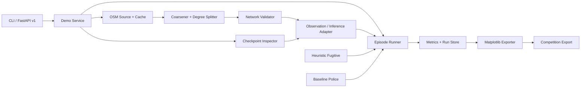

# Design Document: OSM Road Pursuit Demo

## Overview

이 설계는 기존 Python 도로 추격 코드에 제한 영역 OSM 수집, 결정론적 그래프 전처리, 체크포인트 계약 검사, OSM 에피소드 실행, 평가·시각화 및 FastAPI v1 인터페이스를 추가한다. 구현 목표는 실제 OSM 성능을 미리 주장하는 것이 아니라, 실험 가능한 경로와 재현 증거를 만드는 것이다.

현재 저장소 조사 결과는 다음 설계 결정을 뒷받침한다.

- `deployment/osm_loader.py`는 OSMnx 그래프의 모든 노드를 입력 순서대로 재번호화하므로 의사결정점 코어싱, 원본 ID 독립 Canonical_ID, manifest 및 출처 해시가 없다.
- `deployment/inference_engine.py`는 기본 4명과 `[64, 64]`를 사용하고 정렬된 dict 키의 raw 연속 노드 번호를 입력한다. 현재 6명 정책의 의미 계약을 자동 만족하지 않는다.
- `run_road_pursuit_training.py`는 경찰 6명, 최대 진출 차수 5, 관측 21, 행동 6, `[128, 128]`을 사용하며 6x6 합성 격자에서 학습한다.
- `pursuit_evasion_rl/road_pursuit/observations.py`의 기존 21차원 관측은 정규화되었다는 주석과 달리 노드 번호, 이웃 노드 번호, 홉 수 및 raw step을 그대로 반환한다.
- `RoadPursuitEnv`와 `HeuristicFugitive`는 필요한 이동·종료·휴리스틱 골격을 제공하지만 환경이 내부 격자 생성을 고정하고 있어 OSM 네트워크 주입 경로가 필요하다.
- `deployment/api_server.py`는 비버전 전역 메모리 API이고 4명 기본값을 사용한다. v1 서비스 계층과 계약 기반 오류 변환으로 분리해야 한다.
- `requirements.txt`에는 NetworkX, Gymnasium, matplotlib, Hypothesis와 pytest가 있지만 FastAPI, Pydantic, HTTP 테스트 클라이언트 및 OSMnx는 명시되어 있지 않다.

핵심 결정은 **구조 호환성과 의미 호환성을 분리**하는 것이다. 기존 체크포인트는 가중치 형상 검사 후 `legacy_grid_v0`로 직접 OSM에서 실험적으로 실행할 수 있지만 해당 결과는 검증 성능 집계에서 제외한다. OSM 성능 평가 대상 체크포인트는 ID 숫자를 입력하지 않는 `osm_topology_v1` 관측으로 미세조정 또는 재학습하고 manifest에 프로필과 데이터 분할을 기록해야 한다.

구현 언어는 저장소와 동일한 **Python 3**이며, 직렬화 가능한 도메인 모델에는 dataclass/Pydantic, 그래프 연산에는 NetworkX, 정책에는 PyTorch, API에는 FastAPI, 출력에는 matplotlib를 사용한다.

## Architecture


### Package layout and dependency direction

새 기능은 `pursuit_evasion_rl/osm_demo/`에 두고 기존 모듈은 호환 어댑터를 통해 재사용한다.

```text
pursuit_evasion_rl/osm_demo/
  models.py          # immutable domain models and schema versions
  canonical.py       # canonical JSON, hashes, IDs, action ordering
  osm_source.py      # bounded OSMnx fetch and raw conversion
  coarsening.py      # decision-node chains and degree splitting
  cache.py           # immutable atomic bundles
  checkpoint.py      # safe inspection, manifests, compatibility report
  observations.py    # legacy_grid_v0 and osm_topology_v1
  policies.py        # learned adapter, fugitive and police baselines
  environment.py     # injected-network Gymnasium episode environment
  runner.py          # deterministic single/batch execution
  metrics.py         # outcomes, confidence intervals, latency
  claims.py          # evidence-backed claim state transitions
  rendering.py       # matplotlib frames and summaries
  exports.py         # export manifest and competition bundle
  experiments.py     # plans, split guards, fine-tune/retrain records
  service.py         # application use cases and registries
  api_v1.py          # Pydantic schemas and FastAPI APIRouter
```

`deployment/api_server.py`는 기존 import 경로를 유지하되 새 `/api/v1` router를 mount한다. 도메인 계층은 FastAPI, 파일 경로 및 OSMnx 객체를 알지 않으며, API·CLI 계층이 오류를 HTTP/프로세스 종료 코드로 변환한다. `RoadNetwork2D`에는 외부 `ModelNetwork`로부터 생성하는 factory를 추가하거나 같은 조회 protocol을 구현하는 `OSMRoadNetwork`를 제공해 `VehicleState`, reward 및 heuristic 코드를 재사용한다.

### End-to-end flows

1. **Online prepare**: validate bbox → fetch drive graph → clip to bbox → canonical raw snapshot → coarsen/split → validate directed reachability → write immutable cache bundle → register network.
2. **Offline prepare**: calculate cache key → verify committed bundle manifest and every artifact hash → deserialize → validate schemas → register without network access.
3. **Direct legacy experiment**: inspect checkpoint → verify `[21,128,128,6]` actor structure → mark semantic profile unknown/legacy → require explicit `allow_experimental_legacy=true` → run in isolated experiment namespace → exclude from verified aggregates.
4. **OSM policy evaluation**: require `osm_topology_v1` manifest and matching network/runner contracts → run learned policy and baseline on paired seeds → persist artifacts → calculate claims only against a pre-registered experiment plan.
5. **Training path**: create region-disjoint train/validation/test manifests → either initialize from structurally compatible legacy actor or train from scratch → save separate lineage → evaluate unseen regions before claim promotion.

## Components and Interfaces

### 1. Configuration, schemas and canonical serialization

`DemoSettings` fixes supported schema versions, maximum bbox area, CRS policy, coordinate quantization, cache root, capture radius, step duration, maximum steps, minimum evaluation episodes and allowed observation profiles. Daejeon is a named YAML/JSON preset containing explicit north/south/east/west coordinates, `network_type="drive"` and a config version.

`canonical_json(value)` recursively sorts mapping keys, sorts set-like lists by documented stable keys, rejects NaN/Infinity, and emits UTF-8 JSON with fixed separators. Distances and projected coordinates are quantized to configured decimal precision only at serialization boundaries. `sha256(canonical_json)` is used for content hashes; timestamps are excluded from identity hashes and retained only as provenance.

### 2. Bounded OSM source

```python
class OSMSource(Protocol):
    def fetch(self, area: BoundedArea, network_type: str) -> RawOSMGraph: ...
```

`OSMnxSource` calls bbox lookup only; place lookup may resolve a preset but the final fetch and clip always use explicit coordinates. It projects geometry to an appropriate metric CRS through OSMnx/GeoPandas rather than the current equirectangular approximation. Raw nodes contain lat/lon, projected x/y and relevant tags; raw directed edges preserve key, way IDs, oneway state, length, geometry and road class. An injected `FixtureOSMSource` supports all default tests without external calls.

### 3. Deterministic coarsening and canonical IDs

The pipeline is deterministic and versioned:

1. Normalize tags, directed multiedges, geometries and numeric precision.
2. Mark a raw node as a decision node when it is a directed branch/merge, dead end, bbox boundary contact, self-loop endpoint, or endpoint of a road-class/oneway/speed/geometry discontinuity.
3. Walk each unvisited directed edge from one decision node through nodes with exactly one compatible predecessor and successor to the next decision node.
4. Create one directed segment with summed source lengths, concatenated oriented geometry, ordered source edge references and transition attributes.
5. Build each intersection source signature from quantized projected coordinate, normalized decision attributes and local directed topology. Duplicate indistinguishable source signatures are rejected with `CANONICAL_COLLISION`; raw OSM numeric IDs are never a tiebreaker.
6. Sort intersection signatures lexicographically and assign integer IDs `0..N-1`. Sort segments by start signature, end signature, normalized geometry hash and road attribute hash, deduplicate exact duplicates, then assign `0..M-1`.
7. Sort outgoing action slots by signed turn angle from the incoming heading, then absolute bearing, length and segment content hash. At episode start, use north as the reference heading. Canonical_ID values are storage keys only.

For out-degree above five, `DegreeSplitter` groups sorted exits into an acyclic chain of colocated virtual intersections. Each node exposes at most four physical/redirect exits plus one continuation; virtual segments have zero metric length, `is_virtual=true`, and do not advance simulated time. A bounded microstep loop obtains decisions until a physical segment or stay is selected; chain acyclicity and a hop cap prevent infinite routing. The manifest maps every virtual element to the original intersection. If the transform cannot preserve all exits or creates a cycle, validation fails instead of truncating exits.

Directed reachability is compared before and after transformation for all retained bbox-boundary decision signatures. A multi-source traversal records the reachable boundary signature set per boundary. Any difference aborts cache commit. This check verifies topology preservation, not travel-time equivalence.

### 4. Cache, metadata and manifests

A cache key is SHA-256 over bbox coordinates, network type, raw schema version, coarsener version and preprocessing settings hash. A bundle contains:

```text
<cache_root>/<key>/
  raw_osm.json
  model_network.json
  mapping_manifest.json
  network_metadata.json
  bundle_manifest.json   # written last; commit marker and artifact hashes
```

Writers create a sibling temporary directory, fsync files, write the manifest last, and atomically rename the directory when the destination does not exist. Entries are immutable; concurrent creators accept only byte-equivalent winners. Readers require the commit marker, supported schemas and matching hashes before deserialization. Corrupt entries are quarantined logically and never returned. OSM attribution and acquisition time remain in exports. Existing single JSON cache files are treated as legacy input and require explicit migration rather than silent acceptance.
### 5. Checkpoint auto-introspection and compatibility

`CheckpointInspector.inspect(path, optional_manifest)` computes the file SHA-256 and loads tensors on CPU with the safest PyTorch weights-only mode supported by the repository version. It never imports classes from a checkpoint. It locates `police_actor` linear weights by state-dict order and validates the known chain:

```text
network.0.weight: [128, 21]
network.0.bias:   [128]
network.2.weight: [128, 128]
network.2.bias:   [128]
network.4.weight: [6, 128]
network.4.bias:   [6]
```

Equivalent key prefixes are allowed only after ordered linear-layer extraction yields the same chain. Tensor shapes can prove input 21, output 6 and hidden `[128,128]`; they cannot prove police count, flatten order, normalization, training network or performance. Missing manifests therefore produce `structural=pass` where appropriate and `semantic=unknown`, never inferred semantic success.

`CompatibilityReport` has separate `structure`, `semantics`, `network`, and `execution` sections, each containing checks with `pass|warning|fail|unknown`, expected/actual values and stable error codes. Inference is blocked on structural/network/execution failure. A legacy or unknown semantic profile can load but only the explicit experimental route may invoke it.

### 6. Observation and action adapters

Two adapters are intentionally separate:

- `LegacyGridV0Adapter` reproduces the existing sorted-key 21-vector exactly, including unnormalized consecutive node numbers. It exists solely for checkpoint archaeology and explicitly experimental direct inference.
- `OSMTopologyV1Adapter` returns 21 `float32` values: police one-hot (6), `step/max_steps`, segment progress, clipped directed network distance from self to fugitive, clipped directed distance from self to the nearest escape boundary, five destination-to-fugitive distance scores in deterministic action-slot order, and directed self-to-other distances for police IDs 0..5 excluding self then fugitive, padded to six. Distances are divided by a manifest-recorded clipping distance derived from the training corpus; unreachable and padded slots use `1.0`, while the action mask disambiguates padding. Every value is finite in `[0,1]`.

The topology profile uses no raw or canonical numeric identifier as a feature. Relabeling IDs while preserving graph, geometry and agent correspondence leaves its vector and mask unchanged. This makes the representation suitable to construct on arbitrary validated OSM networks; it does **not** prove that a learned policy generalizes to those networks.

The action mask is length six: up to five sorted outgoing slots and stay at index five. Stay is always valid. An index without a corresponding segment is an inference error if selected after masking. `ActionRecommendation` is atomic: action index, segment ID or null for stay, next intersection, validity, probability, profile and compatibility reference must all be present or the whole recommendation fails.

### 7. OSM episode environment and policies

`OSMRoadPursuitEnv` is a Gymnasium-compatible environment constructed from immutable `ModelNetwork` rather than generating a grid. It reuses `VehicleState` behavior but follows polyline arc length, supports directed segments and records incoming heading for action ordering. Reset accepts a seed and optional explicit placements. Default placement deterministically chooses a fugitive in a non-boundary reachable component and six distinct police positions from candidate boundary/interior intersections; no duplicate fallback is allowed.

Each step performs: finish current physical movement → resolve any virtual routing microsteps → evaluate capture → evaluate boundary crossing escape → apply timeout → emit observations. Capture uses projected metric coordinates and wins ties with escape. Escape requires traversing a segment marked as crossing the bbox boundary, not merely reaching an arbitrary degree-one node. Stay is logged when no movement action exists.

Policy interfaces are uniform:

```python
class PolicePolicy(Protocol):
    def act(self, context: DecisionContext) -> TeamAction: ...

class FugitivePolicy(Protocol):
    def act(self, context: DecisionContext) -> int: ...
```

- `LearnedPolicePolicy` wraps the selected adapter and checkpoint actor.
- `BaselinePolicePolicy` independently selects each officer's valid segment minimizing directed distance to the fugitive's current/last observed position; ties use action-slot order.
- `OSMHeuristicFugitive` adapts the existing policy: within metric vision range it maximizes separation from visible police; otherwise it minimizes directed distance to a reachable escape segment; random choices use an injected seeded generator.

`EpisodeRunner` derives component-specific random streams from `(run_seed, episode_index, purpose)` so adding metric or rendering code cannot perturb placement or policy randomness. It records initial state, every action, vehicle state, event and outcome. Batch comparison replays the same placement and fugitive random stream for learned and baseline police. Determinism mode uses greedy learned actions and deterministic PyTorch settings where available; the run manifest records any backend limitations.

### 8. OSM fine-tuning and retraining

Training artifacts are separate from direct legacy experiments:

- `legacy-direct`: no training, opt-in, semantic mismatch visible, `experimental`, excluded from OSM claim promotion.
- `osm-finetune`: initializes only shape-compatible actor weights, trains with `osm_topology_v1`, and records the legacy parent hash.
- `osm-from-scratch`: independent random initialization with the same architecture and OSM split.

Region split manifests contain non-overlapping bbox/polygon identifiers and network hashes for train, validation and test. Split overlap is a hard failure. Both training paths use six police, action 6, observation 21 and hidden `[128,128]`; they write full checkpoint manifests including feature normalization, action ordering, seeds, code version and lineage. Training completion alone remains `experimental`; unseen-region evaluation against the registered plan is required before any result can become verified.

### 9. Metrics, latency and claim evidence

`MetricsCollector` enforces one terminal outcome per episode and count conservation. Per-episode records include outcome, steps, simulated seconds, minimum metric separation, final positions, policy kind and input hashes. Batch summaries include counts/rates, episode-length distribution and a configured binomial confidence interval method.

Latency uses `time.perf_counter_ns()` around generation of all six police actions, including adapter, mask, actor and result decoding but excluding checkpoint/network setup and declared warm-up calls. It records raw milliseconds, sample count, mean, median, p95, max, device, PyTorch version and warm-up count. Non-policy baseline/no-inference rows store `-1` and `not_measured` and are excluded from latency quantiles.

`ClaimRegistry` permits claim promotion only when evidence references immutable checkpoint/network hashes, run config, seed list, episode count and a pre-registered plan. Code existence is `implemented` only after its declared automated checks pass. Legacy-direct outputs cannot promote OSM performance claims. The export always separates implementation status, verified experiments, preliminary/failed experiments, limitations and hypotheses.

### 10. Matplotlib rendering and competition export

`OSMRenderer` draws segment polylines and direction arrows in projected metric coordinates, six police colors/markers, fugitive, active segments, trails and a metric capture circle with equal axis scale. Frame metadata includes run/episode/seed/step/outcome. Font discovery prefers an available Korean font and otherwise switches labels to English and records one warning.

`CompetitionExporter` writes ordered PNG frames (`frame_000000.png` onward), a terminal frame, outcome-rate chart, episode-length histogram, measured-latency distribution and representative path map. It uses an isolated temporary directory and publishes a final immutable export directory containing `export_manifest.json` with dimensions, formats, hashes, code version, claim statuses and OSM attribution. No chart title or caption calls a result verified unless the claim registry supplies verified evidence.

### 11. FastAPI v1

`api_v1.py` defines these operations under `/api/v1`:

| Method | Path | Result |
|---|---|---|
| GET | `/health` | dependency and registry status |
| POST | `/networks/osm` | prepare bounded OSM network |
| POST | `/networks/cache` | load verified cache bundle |
| GET | `/networks/{network_id}` | metadata and validation summary |
| POST | `/compatibility/check` | checkpoint/network report |
| POST | `/actions/recommend` | six atomic recommendations and latency |
| POST | `/runs` | accepted run ID, hashes, seeds and result URL |
| GET | `/runs/{run_id}` | status and episode references |
| GET | `/runs/{run_id}/metrics` | summary metrics and claim boundary |
| POST | `/runs/{run_id}/exports` | create/reuse export and return ID |
| GET | `/exports/{export_id}` | export manifest/location |

Pydantic request/response models reject unknown schema versions and invalid bboxes/agent counts with 422 field paths. Domain not-found maps to 404; compatibility failure to 409 with training guidance; unavailable OSM/model dependency to 503; sanitized unexpected errors to 500 with a correlation ID. Responses never expose absolute local paths or secrets. OpenAPI supplies examples for success and each error class. Run and export registries are repository interfaces with an in-process implementation for the demo and a file-backed artifact implementation for reproducibility; endpoints do not directly mutate module globals.
## Data Models

All persisted models include `schema_version`; Pydantic transport models convert to immutable domain dataclasses at the service boundary.

- `BoundedArea(name, north, south, east, west, max_area_km2, config_version)` validates finite ranges and computes a geodesic-area estimate for the configured limit.
- `RawNode(source_id, lat, lon, x_m, y_m, tags)` and `RawEdge(source_u, source_v, source_key, length_m, geometry_xy, way_refs, oneway, road_class, tags)` retain source provenance. `source_id` is never a model feature.
- `Intersection(id, position_xy, source_signature, boundary_kind, virtual, outgoing_segment_ids, incoming_segment_ids)` and `Segment(id, start_id, end_id, length_m, geometry_xy, source_edge_refs, attributes, virtual, crosses_boundary)` form `ModelNetwork`.
- `MappingManifest(coarsener_version, raw_node_to_intersection, segment_sources, virtual_mappings, canonical_rules, action_ordering)` provides reversible traceability where coarsening permits it.
- `NetworkMetadata(area, source, acquired_at, metric_crs, schema_versions, settings_hash, artifact_hashes, statistics, reachability_digest, validation)` records provenance and validation.
- `BundleManifest(cache_key, artifacts{name,sha256,size}, attribution, committed_at)` is the cache commit marker.
- `CheckpointManifest(checkpoint_hash, architecture, police_count, observation_contract, training_networks, split_manifest_hash, lineage, code_version, claim_status)` contains semantic evidence.
- `InferredCheckpointContract(actor_key, layer_shapes, obs_dim, hidden_dims, action_dim, inferable, unknown)` contains only facts derivable from tensors.
- `CompatibilityCheck(code, status, expected, actual, message)` and `CompatibilityReport(report_id, checkpoint_hash, network_hash, structure, semantics, network, execution, overall)` preserve sectioned decisions.
- `VehiclePlacement(segment_id, progress, intersection_id?)`, `EpisodeConfig(dt_s, speeds, capture_radius_m, max_steps, deterministic)`, and `EpisodeState(step, simulated_s, vehicles, incoming_headings)` define execution state.
- `DecisionContext(network, state, observation, action_mask, rng)` and `ActionRecommendation(agent_id, action_index, segment_id, next_intersection_id, valid, probability, profile)` define policy exchange.
- `EpisodeRecord(run_id, episode_id, seed, initial_state, transitions, outcome, terminal_priority, hashes)` is append-only.
- `LatencySample(value_ms, status, device, warmup)` and `MetricsSummary(outcomes, rates, confidence_intervals, episode_lengths, latency)` separate missing measurements from measured values.
- `ExperimentPlan(plan_id, frozen_config_hash, region_splits, checkpoint_candidates, baseline, seeds, success_criteria)` is immutable once evaluation begins.
- `RunManifest(mode, plan_id?, network_hash, checkpoint_hash?, observation_profile, seeds, policy_kind, claim_status, artifacts)` distinguishes `legacy-direct`, `osm-finetune`, `osm-from-scratch`, `osm-evaluation` and `baseline`.
- `ClaimRecord(name, status, evidence_ids, reason, updated_at)` and `ExportManifest(export_id, input_hashes, files, dimensions, code_version, claims, attribution, warnings)` support non-overstated reporting.

Schema invariants include: unique contiguous canonical IDs, valid segment endpoints, finite metric geometry, nonnegative physical lengths, max out-degree five after splitting, exactly six police, one outcome, hash references to canonical bytes, and no overlap between training and test region hashes.
## Correctness Properties

*A property is a characteristic or behavior that should hold true across all valid executions of a system-essentially, a formal statement about what the system should do. Properties serve as the bridge between human-readable specifications and machine-verifiable correctness guarantees.*

### Redundancy reflection

The prework identified repeated statements of the same invariants. Canonical-ID determinism, repeated processing and raw-ID relabeling are consolidated into Property 1. Segment endpoint, chain, direction and provenance rules are consolidated into Property 2. Degree splitting and boundary reachability are combined because preserving all legal exits is part of preserving directed topology. Observation shape, finiteness, no-ID semantics and relabeling are one stronger metamorphic property. Outcome counts, rates and exactly-one-outcome are one conservation property. Rendering appearance, external OSM behavior, API route wiring, filesystem atomicity and fixed examples remain example/integration tests rather than being forced into universal properties.

### Property 1: Canonicalization is deterministic and source-ID invariant

For any valid Raw_OSM_Graph with unique canonical source signatures and any bijective relabeling or iteration-order permutation of Raw OSM identifiers, coarsening with the same settings produces byte-equivalent Model_Network identity content and Mapping_Manifest canonical content.

**Validates: Requirements 5.6, 5.8, 13.3**

### Property 2: Coarsened segments are valid directed provenance-preserving chains

For any valid directed Raw_OSM_Graph, every physical Segment produced by coarsening references existing Intersections, follows a contiguous allowed directed source-edge chain, equals the sum of source lengths within serialization tolerance, preserves oriented geometry and source references, and adds no direction absent from the source graph.

**Validates: Requirements 5.1, 5.2, 5.3, 5.4, 5.5, 5.7, 13.1**

### Property 3: Degree handling preserves legal exits and boundary reachability

For any valid Raw_OSM_Graph, successful coarsening and degree splitting yields maximum out-degree at most five, maps every legal physical exit exactly once, and preserves the directed reachable-boundary set of every retained boundary signature; otherwise the transform returns a classified incompatibility instead of a partial graph.

**Validates: Requirements 5.9, 6.2, 6.3**

### Property 4: Coarsening normalized output is idempotent

For any valid normalized Model_Network accepted as coarsener input, applying normalization/coarsening once or repeatedly produces equivalent identity content.

**Validates: Requirements 13.4**

### Property 5: Cache keys are deterministic over all identity inputs

For any cache identity input, repeated key construction returns the same key, and changing one of bbox, network type, raw schema version or preprocessing settings changes the canonical key input and therefore its computed digest.

**Validates: Requirements 4.2**

### Property 6: Cache serialization round trips and detects mutation

For any valid cache bundle, save then verified load restores equivalent Model_Network, Mapping_Manifest and core Network_Metadata fields; mutating any committed artifact causes verified load to return a corruption error rather than data.

**Validates: Requirements 4.3, 4.6, 4.7, 13.5**

### Property 7: Input validation accepts exactly the supported domain

For any bounded-area, schema-version and seven-vehicle-placement input, validation succeeds only when coordinates are finite and ordered within geographic and area limits, schemas are supported, the network is nonempty, and every placement references a drivable network position; every invalid dimension yields at least one classified error.

**Validates: Requirements 3.1, 3.2, 3.3, 3.4, 3.5, 3.6, 13.7**

### Property 8: Network statistics equal a reference graph model

For any valid Model_Network, validator counts for intersections, segments, maximum out-degree, weak components, boundary intersections and unreachable segments equal the corresponding simple reference computations.

**Validates: Requirements 6.1, 6.6**

### Property 9: Checkpoint inspection never infers unavailable semantics

For any checkpoint state dictionary, the inspector reports structural dimensions exactly from ordered linear tensor shapes, reports every manifest mismatch, blocks structurally incompatible inference, and leaves police count, observation meaning and training provenance unknown when no manifest proves them.

**Validates: Requirements 7.1, 7.2, 7.3, 7.4, 7.5, 7.6, 7.7**

### Property 10: OSM observations are finite, normalized and relabel-invariant

For any valid Model_Network and corresponding vehicle state, `osm_topology_v1` produces exactly 21 finite `float32` values in `[0,1]`; bijectively relabeling raw and canonical storage IDs while preserving topology, geometry and agent correspondence produces the same vector and action mask.

**Validates: Requirements 7.8, 8.4, 8.11, 13.6, 13.13**

### Property 11: Action masks and recommendations correspond exactly to legal choices

For any validated decision state with at most five ordered outgoing segments, the six-entry mask has one movement bit per outgoing segment and a valid stay bit; a mock policy output selected through that mask resolves to exactly one legal segment/stay and six complete police recommendations, while a masked or incomplete output returns a classified whole-request error.

**Validates: Requirements 6.4, 6.5, 8.1, 8.2, 8.3, 13.2**

### Property 12: Placement and deterministic replay are reproducible

For any placeable Model_Network, episode configuration and Deterministic_Seed, two deterministic runs produce the same seven valid initial placements, action sequence, vehicle-state sequence, events and Episode_Outcome.

**Validates: Requirements 9.1, 9.2, 9.8**

### Property 13: Episode transitions respect directed movement and terminal precedence

For any valid episode transition sequence, physical vehicles move only forward along selected directed segments, actions change segments only at decisions, capture at or inside the radius terminates as capture, bbox-crossing escape applies only when capture is false, timeout applies only when both are false at the limit, and no-movement states select/log stay.

**Validates: Requirements 9.3, 9.4, 9.5, 9.6, 9.7, 9.9**

### Property 14: Outcome aggregation conserves episode membership

For any finite sequence of valid Episode_Outcome values, aggregation assigns exactly one outcome per item, produces counts summing to sequence length, and computes each rate as its count divided by the sequence length when nonempty.

**Validates: Requirements 10.1, 10.2, 10.3, 10.4, 13.8**

### Property 15: Latency summaries match reference statistics

For any nonempty finite sequence of measured nonnegative latency samples plus any number of `not_measured` sentinels, the summary excludes sentinels and matches reference count, mean, median, p95 and maximum calculations while retaining device and warm-up metadata.

**Validates: Requirements 10.5, 10.6, 10.9**

### Property 16: Evidence and claim states cannot overstate experiments

For any claim and evidence set, a verified OSM performance status is unreachable unless reproducible artifacts, immutable plan, network/checkpoint hashes, config, seeds, episode count and success checks are all present; legacy-direct, failed, preliminary or unreproducible evidence cannot promote the claim.

**Validates: Requirements 1.1, 1.3, 1.4, 1.5, 8.5, 8.6, 8.10, 10.7, 10.8, 14.1, 14.5, 14.6**

### Property 17: Training modes and geographic splits remain distinct

For any OSM training record, train/validation/test network hash sets are pairwise disjoint, fine-tune records reference a parent checkpoint, from-scratch records have no parent weights, and completed checkpoint manifests preserve the selected topology profile and unseen-test evidence.

**Validates: Requirements 8.7, 8.8, 8.9, 14.2**

### Property 18: Paired policy comparisons use equivalent accounting

For any paired learned-policy and Baseline_Police batch, both groups use identical initial placements, fugitive random stream, terminal configuration and metric formulas, while their police action streams may differ.

**Validates: Requirements 14.3, 14.4**

### Property 19: Export manifests are complete and content-addressed

For any finalized Competition_Export, every listed file exists with matching hash and dimensions, attribution and claim statuses are preserved, and finalization fails if any required implementation/results/limitations/hypotheses/training-path section is missing.

**Validates: Requirements 11.7, 14.7, 14.8**

## Error Handling

Domain errors derive from `DemoError(code, message, context, retryable)` and carry no raw exception text across the API boundary. Main categories are:

| Category | Examples | API mapping |
|---|---|---|
| `INPUT_INVALID` | bbox, schema, police count, position | 422 |
| `NOT_FOUND` | network/run/export/cache ID | 404 |
| `CACHE_MISS/CACHE_CORRUPT` | no offline entry, hash mismatch | 404/409 |
| `NETWORK_INCOMPATIBLE` | empty graph, degree/reachability/collision | 409 |
| `CHECKPOINT_INCOMPATIBLE` | tensor/profile/config mismatch | 409 |
| `EXPERIMENTAL_OPT_IN_REQUIRED` | legacy direct invocation | 409 |
| `DEPENDENCY_UNAVAILABLE` | OSMnx/network/model device unavailable | 503 |
| `RUN_FAILED/EXPORT_FAILED` | execution or artifact failure | 500 |

Cache writes leave no committed bundle until the final manifest and rename succeed. Run records move through `pending → running → completed|failed`; partial episode logs remain diagnostic artifacts but never enter completed metrics. Export publication follows the same staged-commit rule. API exception middleware logs the internal traceback under a correlation ID and returns only sanitized context. Compatibility and input errors preserve all independently discovered mismatch codes so operators can fix a request in one pass.

## Testing Strategy

Use pytest and Hypothesis already present in the repository. Add pinned FastAPI/Pydantic/HTTPX/OSMnx versions compatible with the selected Python runtime; dependency changes occur in an implementation task, not this spec workflow.

### Property tests

Each correctness property above is implemented by exactly one Hypothesis test with at least 100 generated examples (filesystem-heavy cache tests may use 100 small temporary bundles). Every test includes a comment in this format:

```python
# Feature: osm-road-pursuit-demo, Property 10: OSM observations are finite, normalized and relabel-invariant
```

Generators produce small directed multigraphs, valid/invalid manifests, vehicle states, outcome lists and region partitions. Reference implementations remain intentionally simple. Property 3 limits graph size to keep transitive reachability affordable. Property 15 injects a clock or tests the pure summarizer rather than asserting wall-clock thresholds.

### Unit tests

Example tests cover the Daejeon preset, exact known actor layer shapes, legacy semantic warning, explicit legacy opt-in, capture-over-escape priority, timeout boundary, missing latency sentinel, font fallback, claim promotion failures and sanitized errors. Rendering tests inspect matplotlib artists and metadata rather than pixel-perfect screenshots; a small number of image baselines may cover layout regressions.

### Integration and contract tests

- Fixed offline fixtures include a one-way chain, bidirectional junction, parallel-edge case, out-degree-six split case, bbox crossing and a compact Daejeon-shaped synthetic extract. Fixtures contain raw, model, mapping and metadata artifacts with attribution.
- Default tests patch the OSM source to fail on external access and execute load → coarsen → validate → checkpoint inspect/mock policy → episode → metrics → render → API response.
- FastAPI tests use a test client and dependency injection, checking all v1 operations and 422/404/409/500 schemas.
- Checkpoint tests create synthetic tensors; one opt-in local test may inspect an actual repository checkpoint without assuming its semantic profile.
- Live OSM tests are separately marked and limited to at most three bounded areas. They verify retrieval/provenance only, not external service correctness or model performance.
- Export tests use temporary directories and verify ordered PNG names, manifests, hashes, attribution and disclaimer.

### Experiment tests and performance boundaries

Automated tests verify experiment-plan freezing, region non-overlap, paired seeds and result exclusion rules. They do not assert a capture-rate target or real-time threshold. Actual OSM evaluation is a separate reproducible experiment command that emits artifacts; only its registered success criteria can support later claim changes. Latency tests validate measurement boundaries and statistics with fake clocks, while hardware latency is reported descriptively with device metadata.
