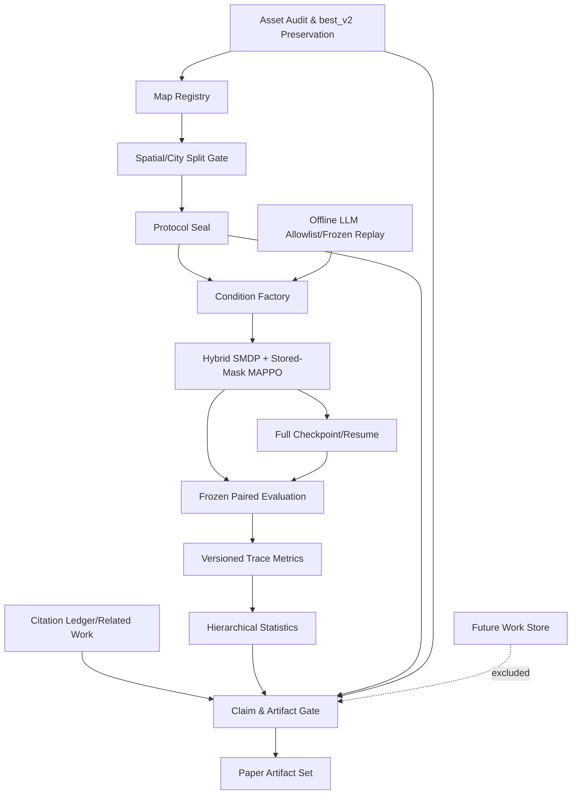

# Design Document: Paper-Grade OSM Pursuit Research

## Overview

이 설계는 기존 OSM 도로 추격 구현을 논문 심사에 견딜 수 있는 **재현 가능하고 실패 폐쇄적인 연구 시스템**으로 확장한다. 목표는 높은 검거율을 전제하는 것이 아니라 Actual OSM provenance, spatial/cross-city generalization, hybrid SMDP, exact stored-mask MAPPO, 여섯 경찰 trace audit, 쌍체 통계, 완전 재개와 paper claim gate를 하나의 content-addressed 계보로 결합하는 것이다.

`training.log`의 최근 100 episode 이동창 최고 0.99와 `checkpoints/osm_mappo/best_v2.pt`는 보존·감사 대상인 `Prior_Result`일 뿐 verified 성능이 아니다. 동일 대전 network에서 seed만 달리한 평가는 `in_distribution_same_network`이며 spatial generalization으로 표현하지 않는다. Synthetic fixture는 Actual OSM 결과로 표현하지 않고, 모든 결과와 무관하게 Field Readiness는 `unsupported`다.

### 설계 원칙과 증거 경계

| 원칙 | 설계 결정 |
|---|---|
| 증거 유형 분리 | implementation existence, test result, experiment observation, paper claim은 서로 대체할 수 없는 typed `EvidenceRecord`다. |
| protocol-owned values | buffer 거리, observation clip/near radius, reward 계수, angular coverage 수식, bootstrap 반복 수, practical threshold, tolerance, missing 처리 등 결과에 영향을 주는 값은 코드 상수가 아니라 sealed `ResearchProtocol` 필드다. 기존 코드 기본값은 `LegacyAuditFact`로만 기록한다. |
| fail closed | 필수 provenance·hash·분할·통계·citation·artifact gate 중 하나라도 실패하면 의존 claim/export를 막고 실패 record를 보존한다. |
| negative results | `completed` 실행의 열세·영 효과는 삭제하거나 failed로 바꾸지 않는다. failed/not_run도 condition matrix에 남긴다. |
| offline default | 기본 시험은 fixture/고정 cache만 사용하고 외부 OSM·LLM 호출은 각각 0회다. 외부 integration은 명시적 opt-in과 별도 run lineage를 요구한다. |

### 연구 질문

`ResearchProtocol.questions`는 각 RQ에 exactly one analysis class, primary outcome, 방향성 부등식, 단위가 있는 practical threshold와 판정 규칙을 요구한다.

| ID | 질문 | 비교와 primary outcome | 제한된 판정 |
|---|---|---|---|
| RQ1 | 보지 않은 OSM 도로와 도시에서 정책이 일반화하는가? | proposed vs budget-matched MAPPO/heuristics의 held-out 및 최소 2개 도시 zero-shot paired capture risk difference | protocol 부등식·threshold·Holm 결과·95% CI를 모두 만족할 때만 supported |
| RQ2 | U-turn suppression과 hysteresis가 포위 안정성을 개선하는가? | 2×2 factorial의 protocol-selected anti-oscillation primary metric, capture non-inferiority를 함께 gate | 안정성 개선 없이 capture만 오르거나 물리 위반이 악화되면 단독 개선 주장 금지 |
| RQ3 | 28D·reward·placement가 어떤 기여를 하는가? | one-factor/capacity-matched ablation의 protocol-selected primary effect | 각 구성요소를 별도 supported/falsified/inconclusive로 판정 |
| RQ4 | offline-only LLM feedback이 수치 기준선 대비 가치가 있는가? | 동일 예산 paired effect와 비용/재현성 | 성능 향상을 전제하지 않고 leakage·replay·cost gate를 함께 적용 |
### 연구 질문과 citation ledger 보존

기존 연구 질문, 검색 provenance 초안, citation ledger 및 related-work matrix를 보존하되 상태를 사실대로 제한한다. 이 설계 갱신에서는 신규 원문 검증을 수행하지 않았으므로 아래 두 현재 검색 후보는 자동 승격하지 않는다.

| Key | 서지 링크 | Ledger 상태 | 비교축 |
|---|---|---|---|
| `oarl22` | [arXiv:2210.13015](https://arxiv.org/abs/2210.13015) | `screening_candidate`, `unverified` | opponent-aware multi-vehicle MARL 후보 |
| `pepcrl24` | [arXiv:2306.05016](https://arxiv.org/abs/2306.05016) | `screening_candidate`, `unverified`; DOI 후보도 pending | progression/prioritized multi-vehicle pursuit 후보 |
| `t3omvp22` | [DOI 10.3390/electronics11091339](https://doi.org/10.3390/electronics11091339) | 기존 `verified_publisher_record`; 세부 matrix는 `pending_extraction` | sensor/observation-constrained pursuit |
| `gradedq22` | [arXiv:2210.13470](https://arxiv.org/abs/2210.13470) | 기존 `verified_preprint`; venue pending | hierarchical multi-vehicle MARL |
| `carpe24` | [arXiv:2405.05372](https://arxiv.org/abs/2405.05372) | 기존 `verified_preprint`; title-version drift 보존 | car-like dynamics와 sensor constraint |
| `mappo22` | [arXiv:2103.01955](https://arxiv.org/abs/2103.01955) | 기존 venue/preprint verified 상태 보존 | cooperative MAPPO 기준 |
| `eureka24` | [OpenReview](https://openreview.net/forum?id=IEduRUO55F), [arXiv:2310.12931](https://arxiv.org/abs/2310.12931) | 기존 venue/preprint verified 상태 보존 | LLM reward design |
| `text2reward24` | [OpenReview](https://openreview.net/forum?id=tUM39YTRxH), [arXiv:2309.11489](https://arxiv.org/abs/2309.11489) | 기존 venue/preprint verified 상태 보존 | LLM reward shaping |
| `coarsening25` | [DOI 10.1007/s41109-024-00689-1](https://doi.org/10.1007/s41109-024-00689-1) | 기존 publisher-record verified 상태 보존 | road-network interception optimization/coarsening |
| `simopt24` | [institutional manuscript](https://dspace.library.uu.nl/handle/1874/451554) | bibliographic core verified, DOI pending | simulation-optimization interception |

`verified`는 ledger에 저장된 공식 metadata 대조와 source hash 범위만 뜻한다. 세부 방법·지도·표본·통계가 원문에서 추출되지 않았으면 matrix 셀은 `pending_extraction` 또는 `not_reported`이며 차별성 근거로 사용할 수 없다. screening candidate, unverified, pending 값은 Novelty Claim의 긍정 근거가 될 수 없다.

#### Related-work matrix 초안

| 축 | road interception/coarsening | multi-vehicle MARL | sensor-constrained pursuit | MAPPO | LLM reward design | 본 연구에서 검증할 축 |
|---|---|---|---|---|---|---|
| 대표 ledger | `coarsening25`, `simopt24` | `oarl22`, `pepcrl24`, `t3omvp22`, `gradedq22` | `carpe24`, `t3omvp22` | `mappo22` | `eureka24`, `text2reward24` | Actual OSM provenance와 source-edge-disjoint split |
| 이동/지도 | road network optimization; 세부는 ledger 상태에 따름 | urban/grid/simulation 후보; 미추출 셀 pending | car-like/sensor constraints | benchmark cooperative games | robotics reward tasks | directed road-arc hybrid SMDP |
| 비교 핵심 | 계산시간·interception 품질 | multi-agent coordination | 관측·동역학 현실성 | centralized training baseline | offline reward/curriculum assistance | stored-mask support, per-officer trace, paired generalization |
| 사용 제한 | RL generalization 근거로 대체 금지 | unverified 후보를 novelty 근거로 금지 | field readiness 근거로 금지 | 환경 특유 mask/SMDP는 별도 검증 | 실시간 제어·test data 사용 금지 | 검증된 직접 비교축만 claim에 연결 |

허용 novelty 문구는 다음 수준으로 제한한다: **“검색·원문 검증 범위에서, Actual OSM provenance, 공간·도시 분리, hybrid road-arc SMDP, exact stored-mask centralized MAPPO, 여섯 경찰 행동 감사와 paired statistics를 함께 평가한다.”** `최초`, `유일` 및 동등한 우선권 표현은 validator가 거부한다.

## Architecture



의존 방향은 `domain <- protocol/maps <- smdp/policies/variants <- training/evaluation <- metrics/statistics <- claims/paper`다. 외부 OSM, 외부 LLM, filesystem은 port 뒤 adapter로만 접근한다. Test/cross-city handle은 tuning process의 타입에 존재하지 않는다.

### Package architecture

```text
pursuit_evasion_rl/research/
  domain.py, canonical.py, errors.py
  audit.py, preservation.py
  protocol.py, leakage.py, execution.py
  literature/{search.py,ledger.py,matrix.py}
  maps/{registry.py,splits.py,snapshots.py}
  smdp.py
  variants/{observations.py,rewards.py,placement.py,stabilization.py,factory.py}
  policies/{interfaces.py,masked_mappo.py,baselines.py}
  training/{trainer.py,checkpoint.py,equivalence.py}
  evaluation/{cases.py,paired.py}
  metrics/{formula_registry.py,behavior.py,physical.py}
  statistics/{paired.py,multiplicity.py}
  llm/{guard.py,offline.py,replay.py}
  runs/{manifest.py,lineage.py}
  claims/gate.py
  paper/{citations.py,tables.py,figures.py,bundle.py,scope.py}
  cli/{audit.py,train.py,evaluate.py,analyze.py,paper.py}
artifacts/research/{preserved,protocols,maps,runs,episodes,analysis,paper,future_work}/
```

기존 root 코드는 audit evidence와 compatibility input일 뿐 논문 trainer API가 아니다. `demo_pursuit.py`, `osm_obs_aug.py`, `train_osm_pursuit.py`, `eval_trained.py`는 regression shim을 거쳐 새 package로 이관한다.

## Components and Interfaces

### C1. Audit, evidence, preservation (Requirements 1–2)

```python
class AssetAuditor(Protocol):
    def inventory(self, revision: CodeRevision) -> ImplementationInventory: ...
    def register_prior(self, raw: PriorResultInput) -> PriorResultRecord: ...

class ArtifactPreserver(Protocol):
    def preserve(self, source: Path, destination: Path) -> PreservedArtifact: ...
    def verify_run_paths(self, paths: RunPaths, artifact: PreservedArtifact) -> GateReport: ...
```

Auditor는 환경·관측·정책·학습·평가·metric·checkpoint별 path/revision/test status를 기록하고 미실행은 이유와 `not_tested`로 둔다. Prior result 분류 우선순위는 known result-changing defect→`invalid`, 그 외 seed<3/episode<100/CI 없음/spatial split 없음 중 하나→`preliminary`, 나머지는 provenance completeness 통과 시에만 `verified`다. 따라서 0.99는 항상 preliminary 제한을 가진다.

Preserver는 원본과 별도 경로의 byte-identical read-only 사본, SHA-256/size/UTC를 기록한다. symlink와 realpath를 해석해 input/output/temp와 보호 경로 overlap을 검사하고 write/move/delete를 차단한다. `best_v2`의 기존 관측 hash/size는 재측정 대상인 audit evidence이지 성공 상수가 아니다.

### C2. Literature and research-question registry (Requirements 3–4)

```python
class CitationLedgerService(Protocol):
    def ingest_search(self, run: SearchRun) -> tuple[CitationCandidate, ...]: ...
    def screen(self, candidate_id: str, decision: ScreeningDecision) -> CitationEntry: ...
    def verify(self, entry_id: str, evidence: SourceVerification) -> CitationEntry: ...

class ResearchQuestionRegistry(Protocol):
    def validate(self, questions: tuple[ResearchQuestion, ...]) -> GateReport: ...
    def adjudicate(self, question_id: str, result: StatisticalResult) -> RQDecision: ...
```

검색 protocol은 결과 접근 전 고정하며 독립 검색원≥3, 학술 색인≥2를 요구한다. 검색 레코드 hash/rank/query/time, canonical duplicate relation, exactly-one screening+reason, official metadata, source location/hash를 저장한다. unverified/pending은 novelty graph에서 타입 수준으로 제외한다. RQ 판정은 `supported|falsified|inconclusive` exactly one이며 부정 결과도 completed 상태로 보존한다.

### C3. Map registry and split/leakage gate (Requirements 5–6)

```python
class MapRegistry(Protocol):
    def register_actual(self, spec: ActualOSMSpec) -> ActualOSMMap: ...
    def register_fixture(self, spec: FixtureSpec) -> SyntheticFixture: ...

class SpatialSplitValidator(Protocol):
    def validate(self, split: SpatialSplit, protocol: FrozenProtocol) -> SplitGateReport: ...

class TuningDataView(Protocol):
    @property
    def train(self) -> tuple[MapRef, ...]: ...
    @property
    def validation(self) -> tuple[MapRef, ...]: ...
```

`RegisteredMap`은 exactly one data kind와 scenario를 가진다. Actual OSM은 query geometry/source/acquired UTC/raw hash/preprocessor/metric CRS/network hash/source edge IDs, fixture는 generator/version/params/seed/hash/purpose를 요구한다. Interior outcome은 `{capture,timeout}`, Boundary는 `{capture,escape,timeout}`이며 동시 충족은 capture 우선이다. episode는 정확히 한 kind×scenario stratum에 배정된다.

`SpatialSplitValidator`는 protocol의 `split_buffer_m>0`와 metric CRS를 사용해 polygon intersection area 0, buffer-crossing node/edge 0, source-edge intersection 0, polygon/network hash 일치를 모두 요구한다. zero-shot registry는 train city가 아닌 최소 두 도시의 Actual OSM snapshot을 요구한다. 동일 network seed 평가는 in-distribution으로 강제한다.

### C4. ResearchProtocol, condition and execution control (Requirements 7, 9–10, 15)

```python
class ProtocolRegistry(Protocol):
    def seal(self, draft: ResearchProtocol, signer: str) -> FrozenProtocol: ...
    def branch(self, parent_hash: str, changes: ProtocolPatch) -> FrozenProtocol: ...

class ConditionFactory(Protocol):
    def make_ablation_matrix(self, protocol: FrozenProtocol) -> ConditionMatrix: ...

class ExecutionLedger(Protocol):
    def finish(self, run_id: str, status: ExecutionStatus, reason: str) -> RunRecord: ...
```

기본 sample plan은 condition당 5 distinct TrainingSeeds와 500 EvaluationEpisodes다. reduced protocol은 결과 접근 전에 모든 confirmatory condition에 공통으로 `3≤seeds≤5`, `100≤episodes≤500`을 정하고 resource inputs와 power limitation을 저장한다. 그 미만은 exploratory다. CheckpointTime은 seed가 아니며 같은 seed의 repeated measure다.

Protocol은 최소 다음 결과영향 필드를 필수로 갖고 validator가 범위·단위·상호 일관성을 검사한다: `split_metric_crs`, `split_buffer_m`, observation clip/near radius와 decision timing, reward formula/coefficient/sign/unit/timing, placement distributions/mixture/support/RNG, U-turn rule/mode/penalty, hysteresis state/minimum hold/switch margin, metric formula version과 모든 window, bootstrap repetitions/rationale, practical thresholds/directions/units, missing/failure mappings, absolute/relative resume tolerances, exact-match backend list, trajectory selection/tie-break, sample/resource plan. 구현 모듈은 protocol hash와 typed field를 입력받으며 연구상 고정값을 숨은 module constant로 갖지 않는다.

### C5. Observation variants (Requirement 9)

`Observation_21D`는 기존 `osm_topology_v1` 계약을 유지한다. `Observation_28D`는 **현재 `osm_obs_aug.py`의 실제 순서와 최종 clip semantics**를 다음처럼 감사한다.

1. `min(distance(self,fugitive)/clip_distance_m,1)`
2. `sin(atan2(fugitive-self))`
3. `(cos(atan2(fugitive-self))+1)/2`
4. `min(team_min_distance/clip_distance_m,1)`
5. `min(team_mean_distance/clip_distance_m,1)`
6. `1-max_circular_bearing_gap/(2π)`
7. `count(team_distance<=near_radius_m)/6`; 현재 legacy code의 near radius 관측값은 200 m다.

이 7개를 21D 뒤에 붙인 뒤 전체 vector에 `np.clip(v,0,1)`을 적용한다. 따라서 **두 번째 sine 값의 음수 구간은 0으로 잘린다**. 이는 shifted sine가 아니며 설계가 임의로 수정하지 않는다. `clip_distance_m`, `near_radius_m`, decision timing은 protocol 필드이고 legacy 2000 m/200 m는 감사 사실로만 보존한다. 성능 기여는 검증 전 가설이다. one-factor pair, parameter/FLOP 동일 규칙, parameter 차이>1%이면 capacity-matched 보조 비교를 요구한다.

### C6. Reward, placement and stabilization variants (Requirements 9–10)

Reward registry는 실제 코드에서 감사한 team minimum-distance progress, own progress/regress, time penalty, capture bonus를 component trace로 분해한다. 계수·부호·거리 scale·regress multiplier·적용 시점은 `protocol.reward_spec`에서만 읽는다. full과 leave-one-component-out, symmetric vs audited asymmetric regress를 one-factor로 만든다.

Placement는 global-only, ring-only, mixed를 포함하며 mixture probability, radius/support, feasibility, RNG stream이 protocol-owned다. 안정화는 U-turn off/on×hysteresis off/on의 정확히 네 arm이다. reverse physical segment 판정, penalty 또는 mask mode, 유지 대상·상태전이·최소 유지·switch 조건을 protocol에 봉인하고 wrapper/U-turn/hysteresis state를 checkpoint에 포함한다.

### C7. Hybrid SMDP and exact stored-mask centralized MAPPO (Requirements 11, 14, 19)

차량은 `parked(intersection)` 또는 `moving(directed_segment, arc_progress)` 상태다. 물리 step은 directed polyline을 `speed×dt`만큼 전진하고 교차로에서만 새 physical segment를 선택한다. degree-split virtual hop은 bounded zero simulated time이다. 경찰별 decision transition은

`z_k=(o_k,a_k,m_k,logπ_old,R_k,τ_k,c_k,c_next,terminal)`

`R_k=Σ_{j=0}^{τ_k-1}γ^j r_{t+j}`, bootstrap discount는 `γ^τ_k`다. 여섯 경찰의 비동기 pending transition을 terminal에서 모두 닫는다.

```python
class ResearchMaskedMAPPO(Protocol):
    def sample(self, actor_obs: Tensor, stored_mask: BoolTensor, rng: RNG) -> ActionSample: ...
    def update(self, batch: DecisionBatch, critic_context: Tensor) -> PPOLoss: ...
```

논문 trainer는 parameter-shared actor와 joint/global input의 centralized critic을 사용한다. actor에는 critic-only privileged context를 주지 않는다. sampling과 PPO recomputation은 transition에 저장된 **동일 mask bytes**를 사용하며 환경에서 mask를 재계산하지 않는다. empty support, selected-invalid, mask hash drift, nonfinite loss는 update 전체를 실패시킨다.

현재 `train_osm_pursuit.py`는 sampling과 자체 `update`에서 저장 mask를 다시 사용하므로 audit evidence로 보존한다. 반면 범용 `pursuit_evasion_rl/training/algorithms.py::_ppo_update`는 action mask를 받지 않아 sampling support와 update support가 어긋날 수 있고 critic도 local observation을 사용한다. 두 경로를 혼동하지 않으며 새 논문 trainer는 범용 `_ppo_update`를 import/call하지 않는 architecture gate를 둔다.

### C8. Baselines and offline LLM (Requirements 11–12)

```python
class PursuitPolicy(Protocol):
    def reset(self, case: EpisodeCase) -> None: ...
    def act(self, observation: ActorObservation, mask: ActionMask) -> Action: ...

class OfflineLLMPort(Protocol):
    def produce_once(self, request: AllowlistedOfflineRequest) -> FrozenLLMArtifact: ...
    def replay(self, artifact_hash: str) -> ValidatedLLMOutput: ...
```

모든 primary stratum은 proposed, budget-matched MAPPO, EncirclementPolice를 포함한다. shortest-path와 greedy-intercept는 공통 interface 적합성 검사 통과 시 포함하고 실패하면 `not_run`+reason을 보존한다. 학습 정책은 environment steps, optimizer updates, resource ceiling, selection data/rule을 맞춘다. 동일 EpisodeCase와 metric contract를 사용하며 열세·동률도 보존한다.

LLM은 `trajectory_critique|role_assignment|curriculum_proposal` 중 protocol이 고른 정확히 하나만 허용한다. episode loop의 외부/로컬 LLM 호출은 0회다. 입력은 train/validation 저장 궤적·보상만 허용하고 test/cross-city handle은 hard fail한다. 출력은 schema 검증 후 hash로 동결해 외부 호출 없이 replay한다. 외부 전송 후보에 PII, 실제 사건, 비공개 위치 또는 비공개 산출물이 있으면 transport에 전달되는 body가 **0 bytes**임을 guard가 보장하고 차단 record를 남긴다.

### C9. Full resume and immutable manifests (Requirement 14)

```python
class CheckpointStore(Protocol):
    def save_atomic(self, state: ResumeState) -> ArtifactRef: ...
    def load_verified(self, ref: ArtifactRef, contract: ResumeContract) -> ResumeState: ...

class ResumeEquivalenceHarness(Protocol):
    def compare(self, continuous: RunRef, resumed: RunRef, spec: ToleranceSpec) -> GateReport: ...
```

ResumeState는 actor/central critic, optimizer, scheduler, scaler, indices, Python/NumPy global+Generator/PyTorch CPU+all device RNG, environment/fugitive/placement/sampler RNG, curriculum, all wrappers(U-turn/hysteresis), running normalization, pending six-agent SMDP transitions, complete rollout buffer와 sampler cursor를 포함한다. compatibility gate는 code/dependencies/protocol/condition/map/split/tensor shape/state hash를 검사한다.

동일 seed의 continuous `N` update와 `K`에서 interrupted-resumed `N-K`를 protocol checkpoint에서 비교한다. deterministic backend는 protocol이 exact-match로 지정하고, 나머지는 field별 `atol/rtol`을 적용한다. 필수 state/metric trace가 tolerance를 넘으면 원 lineage resume를 실패시킨다. sealed manifest는 in-place 변경할 수 없고 변경은 parent를 가진 child run으로 fork한다.

### C10. Paired evaluation and statistics (Requirements 7–8)

EpisodeCase는 map hash, kind/scenario, 여섯 경찰 초기 상태, fugitive 초기 상태, fugitive RNG full state 또는 stream hash, environment/termination config를 canonical hash로 봉인한다. policy comparison은 same TrainingSeed mapping과 same EpisodeCase만 paired다.

Hierarchical paired bootstrap 알고리즘은 다음과 같다.

1. protocol의 `bootstrap_repetitions`(기본 계획 10,000, 다른 양의 정수면 rationale 필수)회 반복한다.
2. TrainingSeed를 outer cluster로 replacement sampling한다.
3. 선택된 각 seed 내부에서 matched EpisodeCase pair를 inner unit으로 replacement sampling한다.
4. 각 resample의 paired estimand를 계산하고 protocol CI method로 95% CI를 만든다.
5. two-sided test, 방향·단위가 있는 effect size, raw/adjusted p, pair/seed 수를 저장한다.

RQ family에 confirmatory 가설이 둘 이상이면 Holm을 적용한다. 우월/비열등 판정은 통계 기준과 practical threshold를 모두 요구한다. failed/interrupted/missing은 policy별 count/reason, protocol primary mapping과 complete-case sensitivity를 함께 보고한다.

### C11. Versioned trace metrics (Requirement 13)

모든 metric 계산은 `protocol.metric_formula_version`과 formula hash를 요구한다. trace는 매 physical step의 SI time/position, segment/progress, decision, legal mask, action, role/target, event와 outcome을 포함한다.

- physical U-turn rate: officer별 연속 **physical** arc pair 중 `(u,v)` 다음 `(v,u)`인 횟수/eligible consecutive pairs.
- revisit rate: protocol window 안에 같은 physical intersection 또는 arc를 재진입한 event 수/eligible entries.
- action/role switch rate: 각각 연속 decision pair에서 action semantic 또는 role이 바뀐 수/eligible pairs.
- legal-move-available idle rate: non-stay legal action이 하나 이상인 decision에서 stay 선택 수/해당 decisions.
- approach/retreat distance: officer–fugitive distance 변화 `Δd=d_t-d_{t+1}`의 positive/negative part를 physical time에 따라 누적한 m.
- zero-displacement time: protocol displacement tolerance 이하인 physical intervals의 duration/episode duration.
- capture-radius entry: outside→inside capture radius crossing count.
- exit-block duration: protocol ETA model에서 officer ETA+margin≤fugitive ETA인 exit별 blocked seconds.
- leave-one-off: same EpisodeCase에서 officer i를 protocol의 registered neutral replacement로 바꾼 `M_full-M_minus_i`; Shapley/인과 효과로 표현하지 않는다.
- bearings `θ_i=atan2(y_i-y_f,x_i-x_f)`를 `[0,2π)`로 정렬하고 `g_i=(θ_(i+1 mod 6)-θ_i) mod 2π`; `g_max=max_i g_i`, `coverage=1-g_max/(2π)`.
- blocked-exit fraction: blocked exits/eligible exits; reachable reduction: `(R_before-R_after)/R_before`의 protocol-defined graph reachability.
- capture metrics: scenario outcome indicators, minimum separation, protocol censoring을 적용한 capture-time estimand.

Physical violation category는 정확히 8개다: `direction_violation`, `contraflow`, `off_road`, `speed_limit_violation`, `teleport`, `discontinuous_segment_transition`, `impossible_immediate_round_trip`, `invalid_action`. 하나라도 양수면 trace hash와 함께 failure ledger에 기록한다. 각 metric은 officer 0..5 여섯 row, team aggregate와 direction-aware worst officer를 갖는다.

### C12. Claim, paper, ethics and future-work gates (Requirements 16–19)

```python
class PaperClaimGate(Protocol):
    def evaluate(self, claim: ClaimRecord, bundle: EvidenceBundle) -> ClaimGateReport: ...

class PaperArtifactBuilder(Protocol):
    def build(self, gated: GatedAnalysisBundle) -> PaperArtifactSet: ...
```

Paper builder는 raw results가 아니라 gated analysis만 읽는다. 필수 절/방정식/RelatedWork/CitationLedger/sealed protocol, seed-level table, CI/test/effect/n, deterministic preselected trajectories, 모든 condition 상태, 네 validity 범주, ethics와 reproducibility를 검사한다. cell/panel은 run ID, script/revision, config/input/output hash로 replay 가능해야 한다.

Claim gate는 evidence type, protocol/classification/status, map/split/leakage, paired statistics, manifest/hash, verified citation와 body-reference-ledger orphan 0을 reconcile한다. `Field_Readiness`는 무조건 unsupported다. 정확히 5개 risk(과도한 추격, 지역 편향, 감시 확대, 자동화 편향, 정책 오용)와 정확히 6개 독립 pre-field validation(교통 미시모사, 센서 불확실성, 인간 참여, 안전, 법률, controlled pilot)의 status를 요구한다.

CCTV, ANPR, 실시간 dashboard, drone/heterogeneous agents는 `future_work_demo` 전용 별도 path/section에만 저장한다. 이 artifact가 novelty, success, primary result, field readiness에 연결되면 gate가 차단한다.

## Data Models

모든 persisted model은 `schema_version`, canonical serialization과 SHA-256 ContentHash를 가진다. enum은 exactly one allowed value를 강제한다.

```python
@dataclass(frozen=True)
class ResearchProtocol:
    protocol_id: str
    questions: tuple[ResearchQuestion, ...]
    search_protocol: SearchProtocol
    split_spec: SpatialSplitSpec          # metric_crs, buffer_m
    observation_spec: ObservationSpec    # clip_m, near_m, timing, final_clip
    reward_spec: RewardSpec              # components, coefficients, signs, units, timing
    placement_spec: PlacementSpec
    stabilization_spec: StabilizationSpec
    metric_spec: MetricFormulaRegistry   # version/hash/windows/ETA/censoring
    sample_plan: SamplePlan              # default 5/500 or common reduced ranges
    statistics_spec: StatisticsSpec      # bootstrap repetitions, Holm families
    threshold_spec: ThresholdRegistry    # direction/unit/practical thresholds
    missing_spec: MissingDataPlan
    tolerance_spec: ToleranceRegistry
    trajectory_selection: TrajectorySelectionRule
    resource_ceiling: ResourceCeiling
    frozen_at_utc: str
    signer: str
    parent_hash: str | None
    content_hash: str
```

주요 persisted types:

- `ImplementationInventory(asset_path, category, code_revision, test_status, reason)`와 `EvidenceRecord(evidence_type, producer, utc, method, source, extracted_value, verification, limitations, content_hash)`.
- `PriorResultRecord(code_revision, data_kind, map_hash, condition_hash, training_seed|unknown, checkpoint_time|unknown, episodes, utc, method, known_defects, unknown_reasons, status)`.
- `PreservedArtifact(original_realpath, copy_realpath, original_hash, copy_hash, byte_size, readonly, measured_utc, usage)`.
- `SearchRun(sources, queries, utc, ranks, raw_hashes)`; `CitationEntry(canonical_id, duplicate_ids, screening, reason, metadata, source_location, source_hash, verification)`; `RelatedWorkRow(..., field_status)`.
- `ResearchQuestion(id, analysis_class, primary_outcome, directional_inequality, practical_threshold, decision_rule)`와 `RQDecision(status, statistical_result_hash)`.
- `ActualOSMMap(query_geometry_hash, source, acquired_utc, raw_hash, preprocessing_version, metric_crs, network_hash, source_edge_ids)`; `SyntheticFixture(generator, version, parameters, seed, hash, purpose)`.
- `SpatialSplit(train, validation, test, city_zero_shot, polygon_hashes, network_hashes, buffer_m, source_edge_sets, gate_hash)`.
- `Condition(policy, observation, reward, placement, uturn, hysteresis, scenario, evader, budget, llm_artifact_hash)`와 `ConditionMatrix`.
- `DecisionTransition(actor_obs, action, stored_mask_bytes, stored_mask_hash, old_log_prob, discounted_reward, duration_steps, critic_context, next_critic_context, terminal)`.
- `EpisodeCase(map_hash, data_kind, scenario, police_initial[6], fugitive_initial, fugitive_rng_state_or_hash, environment_hash, termination_hash, case_hash)`.
- `OfficerTrace(officer_id, physical_samples, decisions, masks, actions, roles, targets, event_hash)`와 `EpisodeRecord(case_hash, policy, training_seed, outcome, execution_status, failure, trace_hash)`.
- `MetricFormula(id, version, expression, unit, direction, window, aggregation, threshold)`; `OfficerMetrics[6]`; `TeamMetrics`; `PhysicalViolationCounts`의 exactly 8 fields.
- `PairedComparison(seed_mapping, case_hashes, mismatches, estimand, effect, ci95, p_raw, p_holm, n_pairs, n_seeds, missing_primary, complete_case_sensitivity)`.
- `ResumeState(model_actor, model_critic, optimizer, scheduler, scaler, indices, rng_bundle, environment_state, fugitive_state, placement_state, sampler_state, curriculum_state, wrapper_state, normalization, pending_smdp[6], rollout_buffer, content_hash)`.
- `ImmutableRunManifest(run_id, parent_id, draft_or_sealed, execution_status, protocol/condition/code/dependency/map/split/input/output hashes, device/runtime, lineage)`.
- `FrozenLLMArtifact(allowlist_task, provider/model/version, prompt/settings, input/output hashes, utc, cost, latency, schema_version, sensitive_scan, replay_hash)`.
- `ClaimRecord(text, scope, status, evidence_ids, analysis_ids, citation_ids, gate_hash)`; `PaperCell/PanelProvenance`; `PreFieldValidation[6]`; `FutureWorkArtifact`.

### Protocol validation rules

`ResearchProtocolValidator`는 positive finite distances, valid probability distributions, positive bootstrap repetitions, default 5/500 또는 common reduced range, threshold direction/unit, complete metric formulas, missing primary+sensitivity, nonnegative tolerances와 exact backend rule을 검증한다. protocol field가 코드 default와 같더라도 hash에 포함한다. 결과 접근 후 변경은 in-place mutation이 아니라 parent hash를 가진 exploratory branch다.
