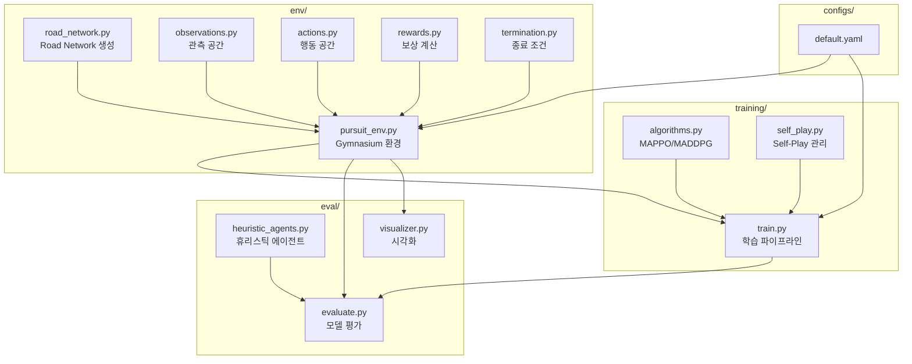
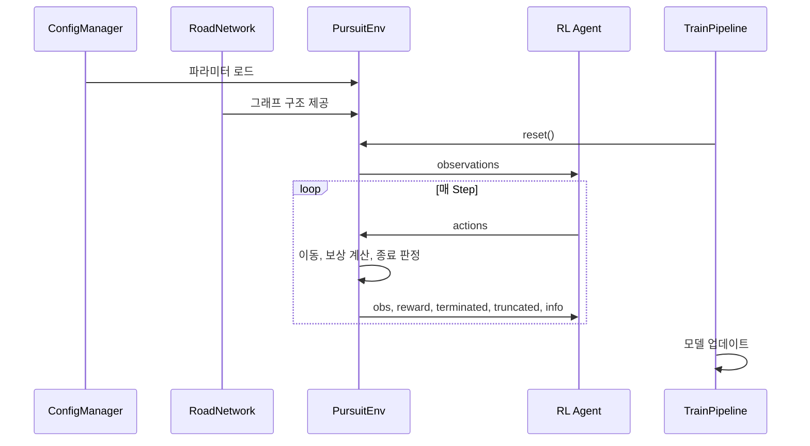

# 설계 문서: RL 추격-도주 시뮬레이션

## Overview

본 시스템은 강화학습(RL) 기반 멀티 에이전트 추격-도주 시뮬레이션이다. 추상화된 그래프 구조의 도로 네트워크 위에서 경찰 에이전트(복수)와 도망자 에이전트(1대)가 상호 대전하며 전략을 학습한다. Python 3.10+ 기반으로, networkx(그래프 표현), gymnasium(환경 인터페이스), stable-baselines3/ray[rllib](학습), matplotlib/pygame(시각화), PyYAML(설정 관리)을 사용한다.

핵심 설계 원칙:
- **모듈성**: 환경, 학습, 평가, 설정을 독립 모듈로 분리
- **확장성**: 알고리즘, 맵, 에이전트 수를 설정 파일로 유연하게 변경
- **표준 호환**: Gymnasium API를 준수하여 다양한 RL 라이브러리와 호환
- **재현성**: seed 기반 랜덤 제어로 실험 재현 보장

## Architecture

### 시스템 구조 다이어그램



### 디렉토리 구조

```
pursuit_evasion_rl/
├── __init__.py
├── env/
│   ├── __init__.py
│   ├── road_network.py       # 도로 네트워크 그래프 생성 및 관리
│   ├── pursuit_env.py        # Gymnasium 환경 메인 클래스
│   ├── observations.py       # 관측 공간 구성
│   ├── actions.py            # 행동 공간 및 마스킹
│   ├── rewards.py            # 보상 계산 로직
│   └── termination.py        # 종료 조건 판정
├── training/
│   ├── __init__.py
│   ├── train.py              # 학습 실행 엔트리포인트
│   ├── algorithms.py         # MAPPO/MADDPG 래퍼
│   └── self_play.py          # Self-Play 학습 매니저
├── eval/
│   ├── __init__.py
│   ├── evaluate.py           # 모델 평가 및 통계 산출
│   ├── heuristic_agents.py   # 휴리스틱 에이전트 구현
│   └── visualizer.py         # 시각화 도구
├── configs/
│   └── default.yaml          # 기본 설정 파일
└── utils/
    ├── __init__.py
    └── config_manager.py     # YAML 설정 파싱 및 검증
```

### 데이터 흐름



## Components and Interfaces

### 1. RoadNetwork (env/road_network.py)

도로 네트워크 그래프 생성 및 관리를 담당한다.

```python
class RoadNetwork:
    def __init__(self, config: dict, seed: int | None = None):
        """
        Args:
            config: 네트워크 설정 (mode, num_nodes, density, fixed_edges 등)
            seed: 랜덤 시드
        """
        self.graph: nx.Graph  # networkx 무향 그래프
        self.boundary_nodes: list[int]  # 경계 노드 목록
        self.num_nodes: int
        self.max_degree: int  # 그래프 내 최대 차수

    def generate(self) -> nx.Graph:
        """그래프 생성 (고정/랜덤 모드)"""

    def _generate_random(self, num_nodes: int, density: float) -> nx.Graph:
        """랜덤 연결 그래프 생성 (최대 100회 재시도)"""

    def _generate_fixed(self, edges: list[tuple[int, int]]) -> nx.Graph:
        """설정 파일 기반 고정 그래프 생성"""

    def _identify_boundary_nodes(self) -> list[int]:
        """degree ≤ 2이고 closeness centrality 하위 25% 노드를 경계 노드로 지정"""

    def get_neighbors(self, node: int) -> list[int]:
        """노드의 인접 노드 목록 반환"""

    def shortest_path_length(self, source: int, target: int) -> int:
        """두 노드 간 최단 경로 거리(홉 수) 반환"""

    def shortest_path(self, source: int, target: int) -> list[int]:
        """두 노드 간 최단 경로 노드 리스트 반환"""
```

### 2. PursuitEnvironment (env/pursuit_env.py)

Gymnasium 환경 메인 클래스. 모든 에이전트의 상태를 관리한다.

```python
class PursuitEnvironment(gymnasium.Env):
    metadata = {"render_modes": ["human", "rgb_array"]}

    def __init__(self, config: dict, render_mode: str | None = None):
        """
        Args:
            config: 환경 설정 딕셔너리
            render_mode: 렌더링 모드
        """
        self.observation_space: gymnasium.spaces.Dict
        self.action_space: gymnasium.spaces.Dict
        self.network: RoadNetwork
        self.num_police: int
        self.max_steps: int

    def reset(self, seed: int | None = None, options: dict | None = None) -> tuple[dict, dict]:
        """환경 초기화, (observations, info) 반환"""

    def step(self, actions: dict[str, int]) -> tuple[dict, dict, dict, dict, dict]:
        """
        한 스텝 실행
        Returns: (observations, rewards, terminated, truncated, info)
        각각 에이전트별 딕셔너리
        """

    def render(self) -> None:
        """현재 상태 시각화"""

    def get_action_masks(self) -> dict[str, np.ndarray]:
        """각 에이전트별 행동 마스크 반환"""
```

### 3. ObservationBuilder (env/observations.py)

에이전트 관측값 구성을 담당한다.

```python
class ObservationBuilder:
    def __init__(self, network: RoadNetwork, num_police: int, max_degree: int):
        """관측 공간 빌더 초기화"""

    def build_observation_space(self) -> gymnasium.spaces.Dict:
        """에이전트별 관측 공간 정의"""

    def get_observation(
        self,
        agent_id: str,
        positions: dict[str, int],
        current_step: int
    ) -> dict[str, np.ndarray]:
        """
        특정 에이전트의 관측값 계산
        포함 항목: 자기 위치, 인접 노드(패딩), 타 에이전트 위치, 
                  최근접 경계 노드 거리, 경과 스텝
        """
```

### 4. ActionHandler (env/actions.py)

행동 공간 정의 및 행동 처리를 담당한다.

```python
class ActionHandler:
    def __init__(self, network: RoadNetwork, max_degree: int):
        """행동 핸들러 초기화"""

    def build_action_space(self) -> gymnasium.spaces.Discrete:
        """이산 행동 공간 정의 (인접 노드 인덱스 + 정지)"""

    def execute_action(self, agent_id: str, action: int, current_node: int) -> int:
        """
        행동 실행, 새 위치 반환
        유효하지 않은 행동 시 현재 위치 유지
        """

    def get_action_mask(self, current_node: int) -> np.ndarray:
        """현재 노드 기준 유효 행동 마스크 반환 (stay는 항상 True)"""

    def is_valid_action(self, action: int, current_node: int) -> bool:
        """행동 유효성 검사"""
```

### 5. RewardCalculator (env/rewards.py)

보상 계산 로직을 담당한다.

```python
class RewardCalculator:
    def __init__(self, network: RoadNetwork, config: dict):
        """
        Args:
            config: 보상 관련 설정 (terminal_reward, shaping_scale, cooperation_bonus 등)
        """

    def compute_step_rewards(
        self,
        positions: dict[str, int],
        prev_positions: dict[str, int],
        invalid_actions: dict[str, bool],
        termination_result: str | None
    ) -> dict[str, float]:
        """
        스텝별 보상 계산
        - Terminal rewards: 종료 시 승패 보상
        - Shaping rewards: 거리 변화 기반 중간 보상 (|값| ≤ 0.1)
        - Cooperation bonus: 포위 보너스
        - Invalid action penalty: -0.01
        """

    def _compute_shaping_reward_police(self, agent_id: str, ...) -> float:
        """경찰 에이전트 shaping 보상 (도망자와의 거리 감소)"""

    def _compute_shaping_reward_fugitive(self, ...) -> float:
        """도망자 shaping 보상 (경계 노드와의 거리 감소)"""

    def _compute_cooperation_bonus(self, positions: dict[str, int]) -> float:
        """협력 보상 (3방향 이상 포위 시 0.05)"""
```

### 6. TerminationChecker (env/termination.py)

에피소드 종료 조건 판정을 담당한다.

```python
class TerminationChecker:
    def __init__(self, network: RoadNetwork, max_steps: int):
        """종료 조건 검사기 초기화"""

    def check(
        self, positions: dict[str, int], current_step: int
    ) -> tuple[str | None, bool, bool]:
        """
        종료 조건 판정
        Returns: (종료 원인, terminated, truncated)
        종료 원인: "police_win" | "fugitive_win" | "timeout" | None
        우선순위: 도망자 승리 > 경찰 승리 > 타임아웃
        """

    def _check_fugitive_escape(self, fugitive_pos: int) -> bool:
        """도망자가 경계 노드에 도달했는지 확인"""

    def _check_police_capture(self, positions: dict[str, int]) -> bool:
        """경찰이 도망자와 동일 노드에 있는지 확인"""

    def _check_police_surround(self, positions: dict[str, int]) -> bool:
        """도망자의 모든 인접 노드가 경찰에 점유되었는지 확인"""

    def _check_path_blocked(self, positions: dict[str, int]) -> bool:
        """도망자에서 모든 경계 노드까지 경로 차단 여부 확인"""
```

### 7. TrainingPipeline (training/train.py)

학습 파이프라인 관리를 담당한다.

```python
class TrainingPipeline:
    def __init__(self, config_path: str = "configs/default.yaml"):
        """설정 로드 및 환경, 알고리즘 초기화"""

    def train(self) -> None:
        """
        Self-Play 학습 실행
        - 에피소드별 보상, 승률, 길이 로깅
        - 체크포인트 간격별 모델 저장
        """

    def _select_algorithm(self, algo_name: str) -> Any:
        """MAPPO 또는 MADDPG 알고리즘 선택"""

    def save_checkpoint(self, episode: int) -> None:
        """모델 체크포인트 저장"""
```

### 8. Evaluator (eval/evaluate.py)

```python
class Evaluator:
    def __init__(self, model_path: str, config_path: str = "configs/default.yaml"):
        """모델 및 환경 로드"""

    def evaluate(self, num_episodes: int = 100) -> dict:
        """
        지정 에피소드 수만큼 평가 실행
        Returns: {"win_rate": float, "avg_reward": float, "avg_length": float}
        """

    def compare_with_heuristic(self, num_episodes: int = 100) -> dict:
        """학습 에이전트 vs 휴리스틱 에이전트 비교 평가"""
```

### 9. HeuristicAgents (eval/heuristic_agents.py)

```python
class HeuristicPoliceAgent:
    def __init__(self, network: RoadNetwork):
        """최단 경로 추격 휴리스틱"""

    def act(self, observation: dict, fugitive_pos: int) -> int:
        """도망자 방향 최단 경로의 다음 노드로 이동 (경로 없으면 stay)"""


class HeuristicFugitiveAgent:
    def __init__(self, network: RoadNetwork):
        """최단 경로 탈출 휴리스틱"""

    def act(self, observation: dict) -> int:
        """가장 가까운 경계 노드 방향 이동 (동일 거리 시 ID 최소 노드 선택)"""
```

### 10. ConfigManager (utils/config_manager.py)

```python
@dataclass
class SimulationConfig:
    # 네트워크 설정
    network_mode: str = "random"        # "random" | "fixed"
    num_nodes: int = 20                 # 4~200
    density: float = 0.3                # 0.0 < x ≤ 1.0
    fixed_edges: list[tuple[int, int]] | None = None

    # 에이전트 설정
    num_police: int = 3                 # 3~20
    max_steps: int = 500                # ≥ 1

    # 학습 하이퍼파라미터
    algorithm: str = "MAPPO"            # "MAPPO" | "MADDPG"
    learning_rate: float = 3e-4         # > 0
    discount_factor: float = 0.99       # 0~1
    epsilon: float = 0.1                # ≥ 0
    batch_size: int = 64                # ≥ 1
    replay_buffer_size: int = 100000    # ≥ 1
    max_episodes: int = 10000           # ≥ 1
    checkpoint_interval: int = 100      # ≥ 1

    # 보상 설정
    terminal_reward: float = 1.0
    shaping_scale: float = 0.1
    cooperation_bonus: float = 0.05
    invalid_action_penalty: float = -0.01


class ConfigManager:
    def __init__(self, config_path: str):
        """YAML 설정 파일 경로"""

    def load(self) -> SimulationConfig:
        """
        설정 파일 로드 및 검증
        - 누락 항목: 기본값 적용 + 경고 메시지
        - 문법 오류: 행 번호 포함 에러 메시지 + 종료
        - 범위 초과: 항목명 + 허용 범위 포함 에러 메시지 + 종료
        """

    def validate(self, config: SimulationConfig) -> list[str]:
        """설정값 유효성 검증, 오류 목록 반환"""

    def serialize(self, config: SimulationConfig) -> str:
        """설정을 YAML 문자열로 직렬화"""

    def round_trip(self, config: SimulationConfig) -> SimulationConfig:
        """직렬화 후 재파싱하여 동일 객체 반환 (round-trip 검증)"""
```

### 11. Visualizer (eval/visualizer.py)

```python
class Visualizer:
    def __init__(self, network: RoadNetwork, render_backend: str = "matplotlib"):
        """
        Args:
            render_backend: "matplotlib" 또는 "pygame"
        """

    def render_frame(self, positions: dict[str, int], step: int) -> None:
        """현재 프레임 렌더링 (경찰: 파랑, 도망자: 빨강, 경계 노드: 초록)"""

    def replay_episode(self, history: list[dict], auto_play: bool = True, frame_interval_ms: int = 500) -> None:
        """에피소드 재생 (자동/수동 모드)"""
```

## Correctness Properties

*속성(Property)은 시스템의 모든 유효한 실행에서 참이어야 하는 특성 또는 행동이다. 즉, 시스템이 무엇을 해야 하는지에 대한 형식적 진술이다. 속성은 사람이 읽을 수 있는 사양과 기계 검증 가능한 정확성 보장 사이의 다리 역할을 한다.*

### Property 1: 그래프 생성 불변량

*For any* 유효한 파라미터 조합(4 ≤ num_nodes ≤ 200, 0.0 < density ≤ 1.0)으로 생성된 RoadNetwork는, 결과 그래프가 무향 연결 그래프이며 노드 수가 요청한 num_nodes와 동일해야 한다.

**Validates: Requirements 1.1, 1.3, 1.7**

### Property 2: 고정 네트워크 멱등성

*For any* 고정 엣지 리스트 설정에 대해, 동일한 설정으로 RoadNetwork를 여러 번 생성하면 매번 동일한 그래프(동일 노드 집합, 동일 엣지 집합)가 생성되어야 한다.

**Validates: Requirements 1.2**

### Property 3: 경계 노드 조건 충족

*For any* 생성된 RoadNetwork에서, 모든 Boundary_Node는 degree가 1 또는 2이며 closeness centrality가 하위 25%에 해당해야 하고, 경계 노드는 최소 1개 이상 존재해야 한다.

**Validates: Requirements 1.4, 1.5**

### Property 4: 유효하지 않은 파라미터 거부

*For any* 유효 범위를 벗어나는 파라미터(num_nodes < 4 또는 > 200, density ≤ 0.0 또는 > 1.0)로 RoadNetwork 생성을 시도하면, 예외가 발생하고 그래프가 생성되지 않아야 한다.

**Validates: Requirements 1.9**

### Property 5: Reset seed 재현성

*For any* 유효한 seed 값에 대해, 동일 seed로 PursuitEnvironment.reset()을 두 번 호출하면 동일한 에이전트 초기 배치가 반환되어야 한다.

**Validates: Requirements 2.2**

### Property 6: 에이전트 위치 불변량

*For any* step 실행 시퀀스에서, 모든 에이전트의 위치는 항상 RoadNetwork의 유효한 Node ID여야 한다.

**Validates: Requirements 2.6**

### Property 7: 에이전트 수 설정 반영

*For any* 3~20 범위의 num_police 설정값에 대해, 환경 생성 후 Police 에이전트 수가 설정값과 동일해야 한다.

**Validates: Requirements 2.5**

### Property 8: 관측값 위치 정확성

*For any* 환경 상태에서, 각 에이전트의 관측값 내 자기 위치(my_position)는 실제 위치와 일치해야 하며, 타 에이전트 위치(other_positions)는 각 에이전트의 실제 위치와 일치해야 한다.

**Validates: Requirements 3.1, 3.3**

### Property 9: 인접 노드 관측 패딩

*For any* 노드에 위치한 에이전트에 대해, 관측값의 neighbors 배열은 길이가 max_degree와 동일하며, 실제 인접 노드 수를 초과하는 슬롯은 -1로 채워져야 한다.

**Validates: Requirements 3.2**

### Property 10: 최단 경로 거리 관측 정확성

*For any* 노드에 위치한 에이전트에 대해, 관측값의 nearest_boundary_dist는 networkx shortest_path_length로 계산한 가장 가까운 Boundary_Node까지의 실제 최단 홉 수와 동일해야 한다.

**Validates: Requirements 3.4**

### Property 11: 스텝 카운터 정확성

*For any* N번의 step 호출 후, 모든 에이전트의 관측값에 포함된 current_step 값은 N이어야 한다.

**Validates: Requirements 3.5**

### Property 12: 행동 실행 정확성

*For any* 노드에 위치한 에이전트가 유효한 인접 노드 인덱스를 선택하면, 해당 에이전트는 그 인접 노드로 이동해야 한다. 정지(stay) 행동 또는 유효하지 않은 행동을 선택하면, 에이전트는 현재 노드에 유지되어야 한다.

**Validates: Requirements 4.2, 4.3, 4.4**

### Property 13: 행동 마스크 정확성

*For any* 노드에 위치한 에이전트에 대해, 행동 마스크에서 True로 표시된 인덱스는 실제로 이동 가능한 인접 노드에 해당하며, stay 인덱스는 항상 True여야 한다.

**Validates: Requirements 4.5, 4.6**

### Property 14: 도망자 탈출 판정

*For any* 배치에서 Fugitive_Agent가 Boundary_Node에 위치하면, 에피소드는 도망자 승리(terminated=True)로 종료되어야 한다.

**Validates: Requirements 5.3**

### Property 15: 경찰 포위 판정

*For any* 배치에서 Fugitive_Agent의 모든 인접 이동 가능 노드가 Police_Agent에 의해 점유되면, 에피소드는 경찰 승리(terminated=True)로 종료되어야 한다.

**Validates: Requirements 5.1**

### Property 16: 종료 조건 우선순위

*For any* 동시에 복수의 종료 조건이 충족되는 상태에서, 판정 결과는 도망자 승리 > 경찰 승리 > 타임아웃 우선순위를 따라야 한다.

**Validates: Requirements 5.6**

### Property 17: Shaping 보상 범위 제한

*For any* 스텝 실행에서, 모든 에이전트에게 부여되는 단일 스텝 Shaping 보상의 절대값은 0.1을 초과하지 않아야 한다.

**Validates: Requirements 6.4, 6.5**

### Property 18: 협력 보상 조건

*For any* 배치에서 Police_Agent들이 Fugitive_Agent 기준 3개 이상의 서로 다른 인접 방향을 점유하고 있으면, 각 Police_Agent에게 0.05의 협력 보상이 부여되어야 한다.

**Validates: Requirements 6.6**

### Property 19: Terminal > Shaping 스케일 불변량

*For any* 완전한 에피소드에서, Terminal_Reward의 절대값은 해당 에피소드 동안 누적된 Shaping 보상 합의 절대값보다 항상 커야 한다.

**Validates: Requirements 6.7**

### Property 20: 무효 행동 페널티

*For any* 유효하지 않은 행동 선택 시, 해당 에이전트에게 정확히 -0.01의 페널티가 부여되고 위치는 변경되지 않아야 한다.

**Validates: Requirements 6.8**

### Property 21: 설정 파일 round-trip

*For any* 유효한 SimulationConfig 객체에 대해, YAML로 직렬화한 후 재파싱하면 원본과 동일한 설정 객체가 생성되어야 한다.

**Validates: Requirements 9.5**

### Property 22: 설정 누락 시 기본값 적용

*For any* 설정 파일에서 임의의 항목이 누락된 경우, ConfigManager는 해당 항목에 사전 정의된 기본값을 적용하고 경고 메시지를 출력해야 한다.

**Validates: Requirements 9.3**

### Property 23: 설정값 범위 검증

*For any* 허용 범위를 벗어나는 설정값(음수 에이전트 수, 0 이하 learning_rate 등)에 대해, ConfigManager.validate()는 오류를 반환해야 한다.

**Validates: Requirements 9.6**

### Property 24: 휴리스틱 경찰 최단 경로 추적

*For any* 유효한 배치에서 경로가 존재할 때, HeuristicPoliceAgent의 행동은 networkx shortest_path가 반환하는 경로의 두 번째 노드에 해당하는 인덱스여야 한다.

**Validates: Requirements 10.1**

### Property 25: 휴리스틱 도망자 탈출 경로 추적

*For any* 유효한 배치에서 경계 노드까지 경로가 존재할 때, HeuristicFugitiveAgent의 행동은 가장 가까운 Boundary_Node(동일 거리 시 ID 최소) 방향의 다음 노드에 해당하는 인덱스여야 한다.

**Validates: Requirements 10.2**

### Property 26: 휴리스틱 대전 에피소드 종료 보장

*For any* 휴리스틱 에이전트 간 대전 에피소드는, Max_Steps 이내에 반드시 종료 조건(경찰 승리, 도망자 승리, 타임아웃) 중 하나에 도달하여 종료되어야 한다.

**Validates: Requirements 10.5**

## Data Models

### 설정 파일 스키마 (configs/default.yaml)

```yaml
network:
  mode: "random"          # "random" | "fixed"
  num_nodes: 20           # 4~200
  density: 0.3            # 0.0 초과 1.0 이하
  fixed_edges: null       # 고정 모드 시 [(src, dst), ...] 리스트

agents:
  num_police: 3           # 3~20
  
environment:
  max_steps: 500          # 1 이상

training:
  algorithm: "MAPPO"      # "MAPPO" | "MADDPG"
  learning_rate: 0.0003
  discount_factor: 0.99
  epsilon: 0.1
  batch_size: 64
  replay_buffer_size: 100000
  max_episodes: 10000
  checkpoint_interval: 100

rewards:
  terminal_reward: 1.0
  shaping_scale: 0.1
  cooperation_bonus: 0.05
  invalid_action_penalty: -0.01

evaluation:
  num_episodes: 100
  model_path: "checkpoints/latest.zip"

visualization:
  backend: "matplotlib"   # "matplotlib" | "pygame"
  frame_interval_ms: 500
```

### 에이전트 상태 모델

```python
@dataclass
class AgentState:
    agent_id: str           # "police_0", "police_1", ..., "fugitive"
    agent_type: str         # "police" | "fugitive"
    position: int           # 현재 노드 ID
    is_active: bool         # 활성 상태 여부

@dataclass
class EnvironmentState:
    agents: dict[str, AgentState]        # 에이전트 상태 맵
    current_step: int                     # 현재 스텝
    network: RoadNetwork                  # 도로 네트워크
    done: bool                            # 에피소드 종료 여부
    termination_reason: str | None        # 종료 원인
```

### 관측값 구조

```python
# 각 에이전트의 관측값 (NumPy 배열)
observation = {
    "my_position": np.array([node_id]),                    # shape: (1,)
    "neighbors": np.array([n1, n2, ..., -1, -1]),          # shape: (max_degree,)
    "other_positions": np.array([pos1, pos2, ...]),        # shape: (num_agents - 1,)
    "nearest_boundary_dist": np.array([distance]),         # shape: (1,)
    "current_step": np.array([step]),                      # shape: (1,)
}
```

### 학습 로그 형식

```python
@dataclass  
class EpisodeLog:
    episode: int
    total_reward_police: float
    total_reward_fugitive: float
    episode_length: int
    termination_reason: str  # "police_win" | "fugitive_win" | "timeout"
    police_win_rate: float   # 최근 N 에피소드 기준
```


## Error Handling

### 그래프 생성 오류

| 오류 상황 | 처리 방식 | 예외 타입 |
|-----------|-----------|-----------|
| 노드 수 범위 초과 (< 4 또는 > 200) | 즉시 예외 발생 | `ValueError` |
| 연결 밀도 범위 초과 (≤ 0.0 또는 > 1.0) | 즉시 예외 발생 | `ValueError` |
| 100회 재생성 후에도 연결 그래프 미생성 | 예외 발생 | `NetworkGenerationError` |
| 고정 모드에서 엣지 리스트 미제공 | 즉시 예외 발생 | `ValueError` |

### 환경 실행 오류

| 오류 상황 | 처리 방식 |
|-----------|-----------|
| action_space 범위 초과 행동 | 행동 무시, 현재 위치 유지, 경고 로그 |
| 유효하지 않은 이동 (미연결 노드) | 행동 무효 처리, stay와 동일 결과, -0.01 페널티 |
| reset 전 step 호출 | `RuntimeError` 발생 |

### 설정 파일 오류

| 오류 상황 | 처리 방식 |
|-----------|-----------|
| 파일 미존재 | `FileNotFoundError` + 오류 메시지 출력 |
| YAML 문법 오류 | 행 번호 포함 에러 메시지 + `SystemExit` |
| 항목 누락 | 기본값 적용 + 경고 메시지 (logging.warning) |
| 값 범위 초과 | 항목명 + 허용 범위 에러 메시지 + `SystemExit` |

### 학습/평가 오류

| 오류 상황 | 처리 방식 |
|-----------|-----------|
| 설정 파일 로드 실패 | 학습 미시작 + 오류 메시지 출력 |
| 모델 파일 미존재 | 평가 중단 + 오류 메시지 출력 |
| 모델 로드 실패 | 평가 중단 + 오류 메시지 출력 |
| 체크포인트 저장 경로 접근 불가 | 경고 로그 + 대체 경로 시도 |


## Testing Strategy

### 접근 방식

본 프로젝트는 **이중 테스트 접근법**을 사용한다:
- **Property-based testing (PBT)**: 모든 유효 입력에 대해 성립해야 하는 보편적 속성 검증
- **Unit testing**: 특정 예시, 에지 케이스, 오류 조건 검증
- **Integration testing**: 컴포넌트 간 연동 및 외부 라이브러리 호환성 검증

### Property-Based Testing 설정

- **라이브러리**: `hypothesis` (Python PBT 표준 라이브러리)
- **최소 반복 횟수**: 각 속성 테스트당 100회 이상
- **태그 형식**: `# Feature: rl-pursuit-evasion-sim, Property {번호}: {속성 설명}`

### 테스트 분류

#### PBT 대상 (Property Tests)

| Property | 대상 컴포넌트 | 생성 전략 |
|----------|--------------|-----------|
| 1: 그래프 생성 불변량 | RoadNetwork | 유효 범위 내 (num_nodes, density) 조합 생성 |
| 2: 고정 네트워크 멱등성 | RoadNetwork | 임의 엣지 리스트 생성 |
| 3: 경계 노드 조건 | RoadNetwork | 생성된 그래프에서 boundary 노드 검증 |
| 4: 유효하지 않은 파라미터 거부 | RoadNetwork | 범위 밖 파라미터 생성 |
| 5: Reset seed 재현성 | PursuitEnvironment | 임의 seed 값 생성 |
| 6: 에이전트 위치 불변량 | PursuitEnvironment | 임의 행동 시퀀스 생성 |
| 7: 에이전트 수 설정 반영 | PursuitEnvironment | 3~20 범위 정수 생성 |
| 8: 관측값 위치 정확성 | ObservationBuilder | 임의 에이전트 배치 생성 |
| 9: 인접 노드 패딩 | ObservationBuilder | 다양한 차수의 노드 선택 |
| 10: 최단 경로 거리 | ObservationBuilder | 임의 노드 위치 생성 |
| 11: 스텝 카운터 | PursuitEnvironment | 임의 스텝 수 (1~100) |
| 12: 행동 실행 정확성 | ActionHandler | 유효/무효/stay 행동 조합 |
| 13: 행동 마스크 정확성 | ActionHandler | 임의 노드 위치 |
| 14: 도망자 탈출 판정 | TerminationChecker | boundary 노드에 도망자 배치 |
| 15: 경찰 포위 판정 | TerminationChecker | 인접 노드 전체 점유 배치 |
| 16: 종료 조건 우선순위 | TerminationChecker | 복수 조건 동시 충족 배치 |
| 17: Shaping 보상 범위 | RewardCalculator | 임의 이동 전후 위치 |
| 18: 협력 보상 조건 | RewardCalculator | 다양한 포위 배치 |
| 19: Terminal > Shaping | RewardCalculator | 완전 에피소드 시뮬레이션 |
| 20: 무효 행동 페널티 | RewardCalculator | 무효 행동 발생 상황 |
| 21: 설정 round-trip | ConfigManager | 임의 유효 SimulationConfig |
| 22: 설정 누락 기본값 | ConfigManager | 임의 항목 누락 YAML |
| 23: 설정값 범위 검증 | ConfigManager | 범위 밖 값 조합 |
| 24: 휴리스틱 경찰 추적 | HeuristicPoliceAgent | 임의 그래프 + 배치 |
| 25: 휴리스틱 도망자 탈출 | HeuristicFugitiveAgent | 임의 그래프 + 배치 |
| 26: 에피소드 종료 보장 | PursuitEnvironment | 휴리스틱 에이전트 대전 |

#### Unit Test 대상 (Example Tests)

- 기본 설정(3 Police, 1 Fugitive) 환경 생성 확인
- 경찰 승리 시 Terminal_Reward 값 (+1.0, -1.0) 확인
- 도망자 승리 시 Terminal_Reward 값 (+1.0, -1.0) 확인
- 타임아웃 시 Terminal_Reward 값 (-0.5) 확인
- Max_Steps 도달 시 truncated=True 확인
- 알고리즘 선택 (MAPPO/MADDPG) 분기 확인
- YAML 문법 오류 시 행 번호 포함 에러 메시지 확인
- 설정 파일 미존재 시 학습 미시작 확인

#### Edge Case 대상

- 연결 그래프 생성 실패 (100회 초과) 시 예외
- 모델 파일 미존재 시 평가 중단
- 경로 미존재 시 휴리스틱 에이전트 stay 행동
- 제거된 에이전트의 위치 -1 표시

#### Integration Test 대상

- Gymnasium env_checker 통과 (SMOKE)
- 학습 파이프라인 end-to-end (짧은 에피소드 수)
- 체크포인트 저장/로드 사이클
- 시각화 렌더링 예외 없이 실행

### 테스트 실행

```bash
# 전체 테스트
pytest tests/ -v

# Property 테스트만 실행
pytest tests/ -v -m "property"

# 특정 컴포넌트 테스트
pytest tests/test_road_network.py -v
pytest tests/test_environment.py -v
pytest tests/test_rewards.py -v
pytest tests/test_config.py -v
pytest tests/test_heuristic.py -v
```

### 커버리지 목표

- **핵심 로직** (env/, utils/): 라인 커버리지 90% 이상
- **학습 파이프라인** (training/): 라인 커버리지 70% 이상 (외부 라이브러리 의존)
- **시각화** (eval/visualizer.py): 기본 실행 확인 (SMOKE 수준)
